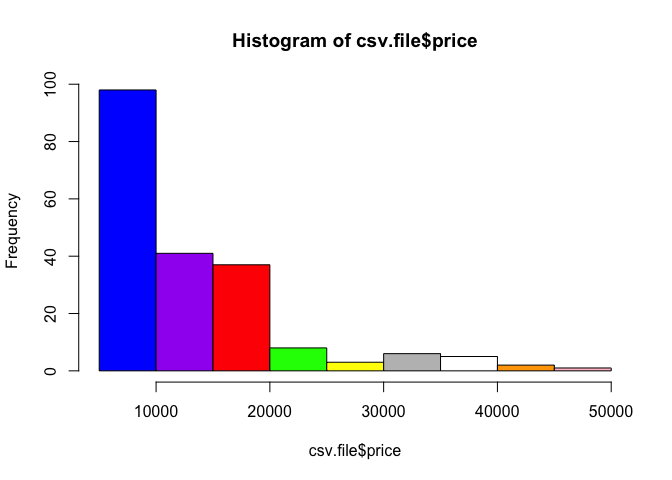
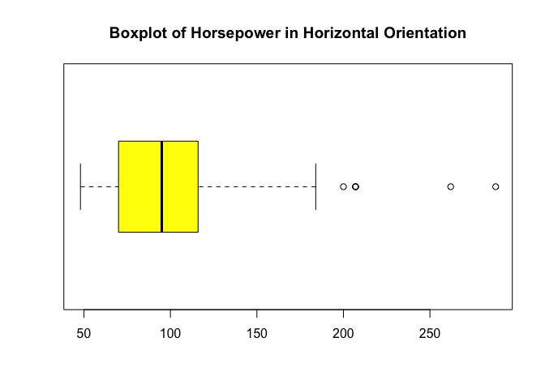
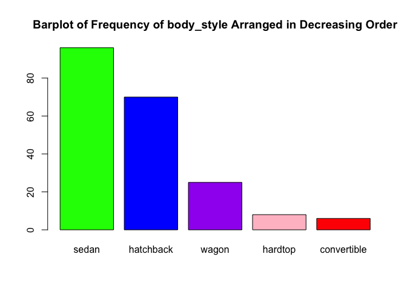
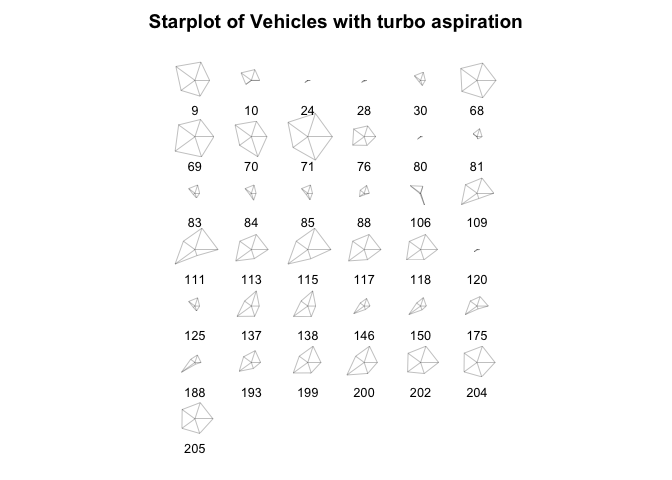
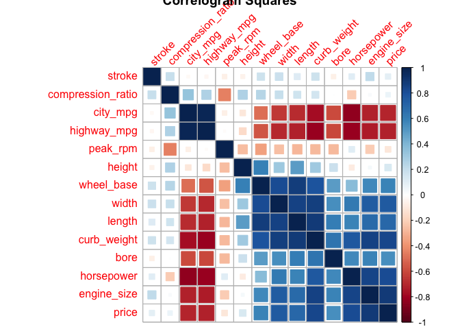
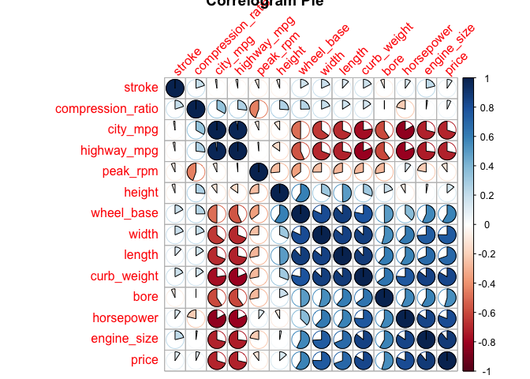
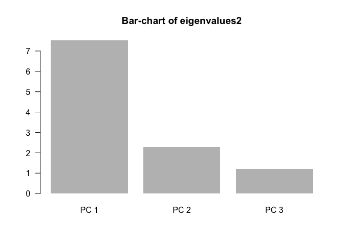
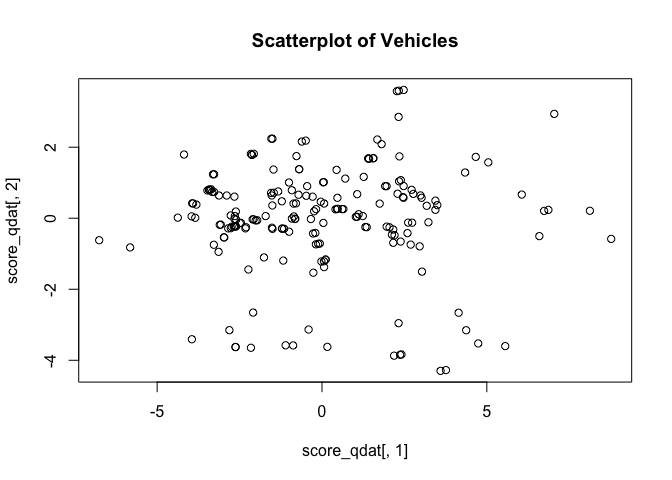
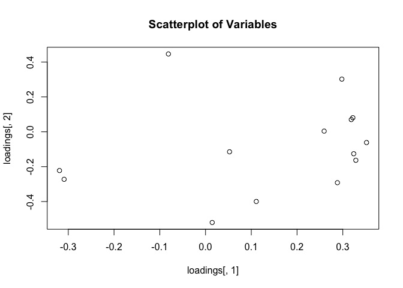

hw01
================
Sizhuo (Cindy) Liu
February 13, 2018

### 2. Data Import

``` r
library(readr)
```

#### Create Vectors

``` r
column_names <- c(
  'symboling',
  'normalized_losses',
  'make',
  'fuel_type',
  'aspiration',
  'num_of_doors',
  'body_style',
  'drive_wheels',
  'engine_location',
  'wheel_base',
  'length',
  'width',
  'height',
  'curb_weight',
  'engine_type',
  'number of cylinders',
  'engine_size',
  'fuel_system',
  'bore',
  'stroke',
  'compression_ratio',
  'horsepower',
  'peak_rpm',
  'city_mpg',
  'highway_mpg',
  'price'
)
col_types <- c(
  'real',
  'real',
  'character',
  'character',
  'character',
  'character',
  'character',
  'character',
  'character',
  'real',
  'real',
  'real',
  'real',
  'integer',
  'character',
  'character',
  'integer',
  'character',
  'real',
  'real',
  'real',
  'integer',
  'integer',
  'integer',
  'integer',
  'integer'
)
```

#### Import the csv File Using read.csv()

``` r
csv.file <-read.csv(file = "imports-85.data",
         col.names = column_names,
         colClasses = col_types,
                  na.strings = "?",
         sep = ",",
         header = FALSE
         )
csv.file
```

    ##     symboling normalized_losses          make fuel_type aspiration
    ## 1           3                NA   alfa-romero       gas        std
    ## 2           3                NA   alfa-romero       gas        std
    ## 3           1                NA   alfa-romero       gas        std
    ## 4           2               164          audi       gas        std
    ## 5           2               164          audi       gas        std
    ## 6           2                NA          audi       gas        std
    ## 7           1               158          audi       gas        std
    ## 8           1                NA          audi       gas        std
    ## 9           1               158          audi       gas      turbo
    ## 10          0                NA          audi       gas      turbo
    ## 11          2               192           bmw       gas        std
    ## 12          0               192           bmw       gas        std
    ## 13          0               188           bmw       gas        std
    ## 14          0               188           bmw       gas        std
    ## 15          1                NA           bmw       gas        std
    ## 16          0                NA           bmw       gas        std
    ## 17          0                NA           bmw       gas        std
    ## 18          0                NA           bmw       gas        std
    ## 19          2               121     chevrolet       gas        std
    ## 20          1                98     chevrolet       gas        std
    ## 21          0                81     chevrolet       gas        std
    ## 22          1               118         dodge       gas        std
    ## 23          1               118         dodge       gas        std
    ## 24          1               118         dodge       gas      turbo
    ## 25          1               148         dodge       gas        std
    ## 26          1               148         dodge       gas        std
    ## 27          1               148         dodge       gas        std
    ## 28          1               148         dodge       gas      turbo
    ## 29         -1               110         dodge       gas        std
    ## 30          3               145         dodge       gas      turbo
    ## 31          2               137         honda       gas        std
    ## 32          2               137         honda       gas        std
    ## 33          1               101         honda       gas        std
    ## 34          1               101         honda       gas        std
    ## 35          1               101         honda       gas        std
    ## 36          0               110         honda       gas        std
    ## 37          0                78         honda       gas        std
    ## 38          0               106         honda       gas        std
    ## 39          0               106         honda       gas        std
    ## 40          0                85         honda       gas        std
    ## 41          0                85         honda       gas        std
    ## 42          0                85         honda       gas        std
    ## 43          1               107         honda       gas        std
    ## 44          0                NA         isuzu       gas        std
    ## 45          1                NA         isuzu       gas        std
    ## 46          0                NA         isuzu       gas        std
    ## 47          2                NA         isuzu       gas        std
    ## 48          0               145        jaguar       gas        std
    ## 49          0                NA        jaguar       gas        std
    ## 50          0                NA        jaguar       gas        std
    ## 51          1               104         mazda       gas        std
    ## 52          1               104         mazda       gas        std
    ## 53          1               104         mazda       gas        std
    ## 54          1               113         mazda       gas        std
    ## 55          1               113         mazda       gas        std
    ## 56          3               150         mazda       gas        std
    ## 57          3               150         mazda       gas        std
    ## 58          3               150         mazda       gas        std
    ## 59          3               150         mazda       gas        std
    ## 60          1               129         mazda       gas        std
    ## 61          0               115         mazda       gas        std
    ## 62          1               129         mazda       gas        std
    ## 63          0               115         mazda       gas        std
    ## 64          0                NA         mazda    diesel        std
    ## 65          0               115         mazda       gas        std
    ## 66          0               118         mazda       gas        std
    ## 67          0                NA         mazda    diesel        std
    ## 68         -1                93 mercedes-benz    diesel      turbo
    ## 69         -1                93 mercedes-benz    diesel      turbo
    ## 70          0                93 mercedes-benz    diesel      turbo
    ## 71         -1                93 mercedes-benz    diesel      turbo
    ## 72         -1                NA mercedes-benz       gas        std
    ## 73          3               142 mercedes-benz       gas        std
    ## 74          0                NA mercedes-benz       gas        std
    ## 75          1                NA mercedes-benz       gas        std
    ## 76          1                NA       mercury       gas      turbo
    ## 77          2               161    mitsubishi       gas        std
    ## 78          2               161    mitsubishi       gas        std
    ## 79          2               161    mitsubishi       gas        std
    ## 80          1               161    mitsubishi       gas      turbo
    ## 81          3               153    mitsubishi       gas      turbo
    ## 82          3               153    mitsubishi       gas        std
    ## 83          3                NA    mitsubishi       gas      turbo
    ## 84          3                NA    mitsubishi       gas      turbo
    ## 85          3                NA    mitsubishi       gas      turbo
    ## 86          1               125    mitsubishi       gas        std
    ## 87          1               125    mitsubishi       gas        std
    ## 88          1               125    mitsubishi       gas      turbo
    ## 89         -1               137    mitsubishi       gas        std
    ## 90          1               128        nissan       gas        std
    ## 91          1               128        nissan    diesel        std
    ## 92          1               128        nissan       gas        std
    ## 93          1               122        nissan       gas        std
    ## 94          1               103        nissan       gas        std
    ## 95          1               128        nissan       gas        std
    ## 96          1               128        nissan       gas        std
    ## 97          1               122        nissan       gas        std
    ## 98          1               103        nissan       gas        std
    ## 99          2               168        nissan       gas        std
    ## 100         0               106        nissan       gas        std
    ## 101         0               106        nissan       gas        std
    ## 102         0               128        nissan       gas        std
    ## 103         0               108        nissan       gas        std
    ## 104         0               108        nissan       gas        std
    ## 105         3               194        nissan       gas        std
    ## 106         3               194        nissan       gas      turbo
    ## 107         1               231        nissan       gas        std
    ## 108         0               161        peugot       gas        std
    ## 109         0               161        peugot    diesel      turbo
    ## 110         0                NA        peugot       gas        std
    ## 111         0                NA        peugot    diesel      turbo
    ## 112         0               161        peugot       gas        std
    ## 113         0               161        peugot    diesel      turbo
    ## 114         0                NA        peugot       gas        std
    ## 115         0                NA        peugot    diesel      turbo
    ## 116         0               161        peugot       gas        std
    ## 117         0               161        peugot    diesel      turbo
    ## 118         0               161        peugot       gas      turbo
    ## 119         1               119      plymouth       gas        std
    ## 120         1               119      plymouth       gas      turbo
    ## 121         1               154      plymouth       gas        std
    ## 122         1               154      plymouth       gas        std
    ## 123         1               154      plymouth       gas        std
    ## 124        -1                74      plymouth       gas        std
    ## 125         3                NA      plymouth       gas      turbo
    ## 126         3               186       porsche       gas        std
    ## 127         3                NA       porsche       gas        std
    ## 128         3                NA       porsche       gas        std
    ## 129         3                NA       porsche       gas        std
    ## 130         1                NA       porsche       gas        std
    ## 131         0                NA       renault       gas        std
    ## 132         2                NA       renault       gas        std
    ## 133         3               150          saab       gas        std
    ## 134         2               104          saab       gas        std
    ## 135         3               150          saab       gas        std
    ## 136         2               104          saab       gas        std
    ## 137         3               150          saab       gas      turbo
    ## 138         2               104          saab       gas      turbo
    ## 139         2                83        subaru       gas        std
    ## 140         2                83        subaru       gas        std
    ## 141         2                83        subaru       gas        std
    ## 142         0               102        subaru       gas        std
    ## 143         0               102        subaru       gas        std
    ## 144         0               102        subaru       gas        std
    ## 145         0               102        subaru       gas        std
    ## 146         0               102        subaru       gas      turbo
    ## 147         0                89        subaru       gas        std
    ## 148         0                89        subaru       gas        std
    ## 149         0                85        subaru       gas        std
    ## 150         0                85        subaru       gas      turbo
    ## 151         1                87        toyota       gas        std
    ## 152         1                87        toyota       gas        std
    ## 153         1                74        toyota       gas        std
    ## 154         0                77        toyota       gas        std
    ## 155         0                81        toyota       gas        std
    ## 156         0                91        toyota       gas        std
    ## 157         0                91        toyota       gas        std
    ## 158         0                91        toyota       gas        std
    ## 159         0                91        toyota    diesel        std
    ## 160         0                91        toyota    diesel        std
    ## 161         0                91        toyota       gas        std
    ## 162         0                91        toyota       gas        std
    ## 163         0                91        toyota       gas        std
    ## 164         1               168        toyota       gas        std
    ## 165         1               168        toyota       gas        std
    ## 166         1               168        toyota       gas        std
    ## 167         1               168        toyota       gas        std
    ## 168         2               134        toyota       gas        std
    ## 169         2               134        toyota       gas        std
    ## 170         2               134        toyota       gas        std
    ## 171         2               134        toyota       gas        std
    ## 172         2               134        toyota       gas        std
    ## 173         2               134        toyota       gas        std
    ## 174        -1                65        toyota       gas        std
    ## 175        -1                65        toyota    diesel      turbo
    ## 176        -1                65        toyota       gas        std
    ## 177        -1                65        toyota       gas        std
    ## 178        -1                65        toyota       gas        std
    ## 179         3               197        toyota       gas        std
    ## 180         3               197        toyota       gas        std
    ## 181        -1                90        toyota       gas        std
    ## 182        -1                NA        toyota       gas        std
    ## 183         2               122    volkswagen    diesel        std
    ## 184         2               122    volkswagen       gas        std
    ## 185         2                94    volkswagen    diesel        std
    ## 186         2                94    volkswagen       gas        std
    ## 187         2                94    volkswagen       gas        std
    ## 188         2                94    volkswagen    diesel      turbo
    ## 189         2                94    volkswagen       gas        std
    ## 190         3                NA    volkswagen       gas        std
    ## 191         3               256    volkswagen       gas        std
    ## 192         0                NA    volkswagen       gas        std
    ## 193         0                NA    volkswagen    diesel      turbo
    ## 194         0                NA    volkswagen       gas        std
    ## 195        -2               103         volvo       gas        std
    ## 196        -1                74         volvo       gas        std
    ## 197        -2               103         volvo       gas        std
    ## 198        -1                74         volvo       gas        std
    ## 199        -2               103         volvo       gas      turbo
    ## 200        -1                74         volvo       gas      turbo
    ## 201        -1                95         volvo       gas        std
    ## 202        -1                95         volvo       gas      turbo
    ## 203        -1                95         volvo       gas        std
    ## 204        -1                95         volvo    diesel      turbo
    ## 205        -1                95         volvo       gas      turbo
    ##     num_of_doors  body_style drive_wheels engine_location wheel_base
    ## 1            two convertible          rwd           front       88.6
    ## 2            two convertible          rwd           front       88.6
    ## 3            two   hatchback          rwd           front       94.5
    ## 4           four       sedan          fwd           front       99.8
    ## 5           four       sedan          4wd           front       99.4
    ## 6            two       sedan          fwd           front       99.8
    ## 7           four       sedan          fwd           front      105.8
    ## 8           four       wagon          fwd           front      105.8
    ## 9           four       sedan          fwd           front      105.8
    ## 10           two   hatchback          4wd           front       99.5
    ## 11           two       sedan          rwd           front      101.2
    ## 12          four       sedan          rwd           front      101.2
    ## 13           two       sedan          rwd           front      101.2
    ## 14          four       sedan          rwd           front      101.2
    ## 15          four       sedan          rwd           front      103.5
    ## 16          four       sedan          rwd           front      103.5
    ## 17           two       sedan          rwd           front      103.5
    ## 18          four       sedan          rwd           front      110.0
    ## 19           two   hatchback          fwd           front       88.4
    ## 20           two   hatchback          fwd           front       94.5
    ## 21          four       sedan          fwd           front       94.5
    ## 22           two   hatchback          fwd           front       93.7
    ## 23           two   hatchback          fwd           front       93.7
    ## 24           two   hatchback          fwd           front       93.7
    ## 25          four   hatchback          fwd           front       93.7
    ## 26          four       sedan          fwd           front       93.7
    ## 27          four       sedan          fwd           front       93.7
    ## 28          <NA>       sedan          fwd           front       93.7
    ## 29          four       wagon          fwd           front      103.3
    ## 30           two   hatchback          fwd           front       95.9
    ## 31           two   hatchback          fwd           front       86.6
    ## 32           two   hatchback          fwd           front       86.6
    ## 33           two   hatchback          fwd           front       93.7
    ## 34           two   hatchback          fwd           front       93.7
    ## 35           two   hatchback          fwd           front       93.7
    ## 36          four       sedan          fwd           front       96.5
    ## 37          four       wagon          fwd           front       96.5
    ## 38           two   hatchback          fwd           front       96.5
    ## 39           two   hatchback          fwd           front       96.5
    ## 40          four       sedan          fwd           front       96.5
    ## 41          four       sedan          fwd           front       96.5
    ## 42          four       sedan          fwd           front       96.5
    ## 43           two       sedan          fwd           front       96.5
    ## 44          four       sedan          rwd           front       94.3
    ## 45           two       sedan          fwd           front       94.5
    ## 46          four       sedan          fwd           front       94.5
    ## 47           two   hatchback          rwd           front       96.0
    ## 48          four       sedan          rwd           front      113.0
    ## 49          four       sedan          rwd           front      113.0
    ## 50           two       sedan          rwd           front      102.0
    ## 51           two   hatchback          fwd           front       93.1
    ## 52           two   hatchback          fwd           front       93.1
    ## 53           two   hatchback          fwd           front       93.1
    ## 54          four       sedan          fwd           front       93.1
    ## 55          four       sedan          fwd           front       93.1
    ## 56           two   hatchback          rwd           front       95.3
    ## 57           two   hatchback          rwd           front       95.3
    ## 58           two   hatchback          rwd           front       95.3
    ## 59           two   hatchback          rwd           front       95.3
    ## 60           two   hatchback          fwd           front       98.8
    ## 61          four       sedan          fwd           front       98.8
    ## 62           two   hatchback          fwd           front       98.8
    ## 63          four       sedan          fwd           front       98.8
    ## 64          <NA>       sedan          fwd           front       98.8
    ## 65          four   hatchback          fwd           front       98.8
    ## 66          four       sedan          rwd           front      104.9
    ## 67          four       sedan          rwd           front      104.9
    ## 68          four       sedan          rwd           front      110.0
    ## 69          four       wagon          rwd           front      110.0
    ## 70           two     hardtop          rwd           front      106.7
    ## 71          four       sedan          rwd           front      115.6
    ## 72          four       sedan          rwd           front      115.6
    ## 73           two convertible          rwd           front       96.6
    ## 74          four       sedan          rwd           front      120.9
    ## 75           two     hardtop          rwd           front      112.0
    ## 76           two   hatchback          rwd           front      102.7
    ## 77           two   hatchback          fwd           front       93.7
    ## 78           two   hatchback          fwd           front       93.7
    ## 79           two   hatchback          fwd           front       93.7
    ## 80           two   hatchback          fwd           front       93.0
    ## 81           two   hatchback          fwd           front       96.3
    ## 82           two   hatchback          fwd           front       96.3
    ## 83           two   hatchback          fwd           front       95.9
    ## 84           two   hatchback          fwd           front       95.9
    ## 85           two   hatchback          fwd           front       95.9
    ## 86          four       sedan          fwd           front       96.3
    ## 87          four       sedan          fwd           front       96.3
    ## 88          four       sedan          fwd           front       96.3
    ## 89          four       sedan          fwd           front       96.3
    ## 90           two       sedan          fwd           front       94.5
    ## 91           two       sedan          fwd           front       94.5
    ## 92           two       sedan          fwd           front       94.5
    ## 93          four       sedan          fwd           front       94.5
    ## 94          four       wagon          fwd           front       94.5
    ## 95           two       sedan          fwd           front       94.5
    ## 96           two   hatchback          fwd           front       94.5
    ## 97          four       sedan          fwd           front       94.5
    ## 98          four       wagon          fwd           front       94.5
    ## 99           two     hardtop          fwd           front       95.1
    ## 100         four   hatchback          fwd           front       97.2
    ## 101         four       sedan          fwd           front       97.2
    ## 102         four       sedan          fwd           front      100.4
    ## 103         four       wagon          fwd           front      100.4
    ## 104         four       sedan          fwd           front      100.4
    ## 105          two   hatchback          rwd           front       91.3
    ## 106          two   hatchback          rwd           front       91.3
    ## 107          two   hatchback          rwd           front       99.2
    ## 108         four       sedan          rwd           front      107.9
    ## 109         four       sedan          rwd           front      107.9
    ## 110         four       wagon          rwd           front      114.2
    ## 111         four       wagon          rwd           front      114.2
    ## 112         four       sedan          rwd           front      107.9
    ## 113         four       sedan          rwd           front      107.9
    ## 114         four       wagon          rwd           front      114.2
    ## 115         four       wagon          rwd           front      114.2
    ## 116         four       sedan          rwd           front      107.9
    ## 117         four       sedan          rwd           front      107.9
    ## 118         four       sedan          rwd           front      108.0
    ## 119          two   hatchback          fwd           front       93.7
    ## 120          two   hatchback          fwd           front       93.7
    ## 121         four   hatchback          fwd           front       93.7
    ## 122         four       sedan          fwd           front       93.7
    ## 123         four       sedan          fwd           front       93.7
    ## 124         four       wagon          fwd           front      103.3
    ## 125          two   hatchback          rwd           front       95.9
    ## 126          two   hatchback          rwd           front       94.5
    ## 127          two     hardtop          rwd            rear       89.5
    ## 128          two     hardtop          rwd            rear       89.5
    ## 129          two convertible          rwd            rear       89.5
    ## 130          two   hatchback          rwd           front       98.4
    ## 131         four       wagon          fwd           front       96.1
    ## 132          two   hatchback          fwd           front       96.1
    ## 133          two   hatchback          fwd           front       99.1
    ## 134         four       sedan          fwd           front       99.1
    ## 135          two   hatchback          fwd           front       99.1
    ## 136         four       sedan          fwd           front       99.1
    ## 137          two   hatchback          fwd           front       99.1
    ## 138         four       sedan          fwd           front       99.1
    ## 139          two   hatchback          fwd           front       93.7
    ## 140          two   hatchback          fwd           front       93.7
    ## 141          two   hatchback          4wd           front       93.3
    ## 142         four       sedan          fwd           front       97.2
    ## 143         four       sedan          fwd           front       97.2
    ## 144         four       sedan          fwd           front       97.2
    ## 145         four       sedan          4wd           front       97.0
    ## 146         four       sedan          4wd           front       97.0
    ## 147         four       wagon          fwd           front       97.0
    ## 148         four       wagon          fwd           front       97.0
    ## 149         four       wagon          4wd           front       96.9
    ## 150         four       wagon          4wd           front       96.9
    ## 151          two   hatchback          fwd           front       95.7
    ## 152          two   hatchback          fwd           front       95.7
    ## 153         four   hatchback          fwd           front       95.7
    ## 154         four       wagon          fwd           front       95.7
    ## 155         four       wagon          4wd           front       95.7
    ## 156         four       wagon          4wd           front       95.7
    ## 157         four       sedan          fwd           front       95.7
    ## 158         four   hatchback          fwd           front       95.7
    ## 159         four       sedan          fwd           front       95.7
    ## 160         four   hatchback          fwd           front       95.7
    ## 161         four       sedan          fwd           front       95.7
    ## 162         four   hatchback          fwd           front       95.7
    ## 163         four       sedan          fwd           front       95.7
    ## 164          two       sedan          rwd           front       94.5
    ## 165          two   hatchback          rwd           front       94.5
    ## 166          two       sedan          rwd           front       94.5
    ## 167          two   hatchback          rwd           front       94.5
    ## 168          two     hardtop          rwd           front       98.4
    ## 169          two     hardtop          rwd           front       98.4
    ## 170          two   hatchback          rwd           front       98.4
    ## 171          two     hardtop          rwd           front       98.4
    ## 172          two   hatchback          rwd           front       98.4
    ## 173          two convertible          rwd           front       98.4
    ## 174         four       sedan          fwd           front      102.4
    ## 175         four       sedan          fwd           front      102.4
    ## 176         four   hatchback          fwd           front      102.4
    ## 177         four       sedan          fwd           front      102.4
    ## 178         four   hatchback          fwd           front      102.4
    ## 179          two   hatchback          rwd           front      102.9
    ## 180          two   hatchback          rwd           front      102.9
    ## 181         four       sedan          rwd           front      104.5
    ## 182         four       wagon          rwd           front      104.5
    ## 183          two       sedan          fwd           front       97.3
    ## 184          two       sedan          fwd           front       97.3
    ## 185         four       sedan          fwd           front       97.3
    ## 186         four       sedan          fwd           front       97.3
    ## 187         four       sedan          fwd           front       97.3
    ## 188         four       sedan          fwd           front       97.3
    ## 189         four       sedan          fwd           front       97.3
    ## 190          two convertible          fwd           front       94.5
    ## 191          two   hatchback          fwd           front       94.5
    ## 192         four       sedan          fwd           front      100.4
    ## 193         four       sedan          fwd           front      100.4
    ## 194         four       wagon          fwd           front      100.4
    ## 195         four       sedan          rwd           front      104.3
    ## 196         four       wagon          rwd           front      104.3
    ## 197         four       sedan          rwd           front      104.3
    ## 198         four       wagon          rwd           front      104.3
    ## 199         four       sedan          rwd           front      104.3
    ## 200         four       wagon          rwd           front      104.3
    ## 201         four       sedan          rwd           front      109.1
    ## 202         four       sedan          rwd           front      109.1
    ## 203         four       sedan          rwd           front      109.1
    ## 204         four       sedan          rwd           front      109.1
    ## 205         four       sedan          rwd           front      109.1
    ##     length width height curb_weight engine_type number.of.cylinders
    ## 1    168.8  64.1   48.8        2548        dohc                four
    ## 2    168.8  64.1   48.8        2548        dohc                four
    ## 3    171.2  65.5   52.4        2823        ohcv                 six
    ## 4    176.6  66.2   54.3        2337         ohc                four
    ## 5    176.6  66.4   54.3        2824         ohc                five
    ## 6    177.3  66.3   53.1        2507         ohc                five
    ## 7    192.7  71.4   55.7        2844         ohc                five
    ## 8    192.7  71.4   55.7        2954         ohc                five
    ## 9    192.7  71.4   55.9        3086         ohc                five
    ## 10   178.2  67.9   52.0        3053         ohc                five
    ## 11   176.8  64.8   54.3        2395         ohc                four
    ## 12   176.8  64.8   54.3        2395         ohc                four
    ## 13   176.8  64.8   54.3        2710         ohc                 six
    ## 14   176.8  64.8   54.3        2765         ohc                 six
    ## 15   189.0  66.9   55.7        3055         ohc                 six
    ## 16   189.0  66.9   55.7        3230         ohc                 six
    ## 17   193.8  67.9   53.7        3380         ohc                 six
    ## 18   197.0  70.9   56.3        3505         ohc                 six
    ## 19   141.1  60.3   53.2        1488           l               three
    ## 20   155.9  63.6   52.0        1874         ohc                four
    ## 21   158.8  63.6   52.0        1909         ohc                four
    ## 22   157.3  63.8   50.8        1876         ohc                four
    ## 23   157.3  63.8   50.8        1876         ohc                four
    ## 24   157.3  63.8   50.8        2128         ohc                four
    ## 25   157.3  63.8   50.6        1967         ohc                four
    ## 26   157.3  63.8   50.6        1989         ohc                four
    ## 27   157.3  63.8   50.6        1989         ohc                four
    ## 28   157.3  63.8   50.6        2191         ohc                four
    ## 29   174.6  64.6   59.8        2535         ohc                four
    ## 30   173.2  66.3   50.2        2811         ohc                four
    ## 31   144.6  63.9   50.8        1713         ohc                four
    ## 32   144.6  63.9   50.8        1819         ohc                four
    ## 33   150.0  64.0   52.6        1837         ohc                four
    ## 34   150.0  64.0   52.6        1940         ohc                four
    ## 35   150.0  64.0   52.6        1956         ohc                four
    ## 36   163.4  64.0   54.5        2010         ohc                four
    ## 37   157.1  63.9   58.3        2024         ohc                four
    ## 38   167.5  65.2   53.3        2236         ohc                four
    ## 39   167.5  65.2   53.3        2289         ohc                four
    ## 40   175.4  65.2   54.1        2304         ohc                four
    ## 41   175.4  62.5   54.1        2372         ohc                four
    ## 42   175.4  65.2   54.1        2465         ohc                four
    ## 43   169.1  66.0   51.0        2293         ohc                four
    ## 44   170.7  61.8   53.5        2337         ohc                four
    ## 45   155.9  63.6   52.0        1874         ohc                four
    ## 46   155.9  63.6   52.0        1909         ohc                four
    ## 47   172.6  65.2   51.4        2734         ohc                four
    ## 48   199.6  69.6   52.8        4066        dohc                 six
    ## 49   199.6  69.6   52.8        4066        dohc                 six
    ## 50   191.7  70.6   47.8        3950        ohcv              twelve
    ## 51   159.1  64.2   54.1        1890         ohc                four
    ## 52   159.1  64.2   54.1        1900         ohc                four
    ## 53   159.1  64.2   54.1        1905         ohc                four
    ## 54   166.8  64.2   54.1        1945         ohc                four
    ## 55   166.8  64.2   54.1        1950         ohc                four
    ## 56   169.0  65.7   49.6        2380       rotor                 two
    ## 57   169.0  65.7   49.6        2380       rotor                 two
    ## 58   169.0  65.7   49.6        2385       rotor                 two
    ## 59   169.0  65.7   49.6        2500       rotor                 two
    ## 60   177.8  66.5   53.7        2385         ohc                four
    ## 61   177.8  66.5   55.5        2410         ohc                four
    ## 62   177.8  66.5   53.7        2385         ohc                four
    ## 63   177.8  66.5   55.5        2410         ohc                four
    ## 64   177.8  66.5   55.5        2443         ohc                four
    ## 65   177.8  66.5   55.5        2425         ohc                four
    ## 66   175.0  66.1   54.4        2670         ohc                four
    ## 67   175.0  66.1   54.4        2700         ohc                four
    ## 68   190.9  70.3   56.5        3515         ohc                five
    ## 69   190.9  70.3   58.7        3750         ohc                five
    ## 70   187.5  70.3   54.9        3495         ohc                five
    ## 71   202.6  71.7   56.3        3770         ohc                five
    ## 72   202.6  71.7   56.5        3740        ohcv               eight
    ## 73   180.3  70.5   50.8        3685        ohcv               eight
    ## 74   208.1  71.7   56.7        3900        ohcv               eight
    ## 75   199.2  72.0   55.4        3715        ohcv               eight
    ## 76   178.4  68.0   54.8        2910         ohc                four
    ## 77   157.3  64.4   50.8        1918         ohc                four
    ## 78   157.3  64.4   50.8        1944         ohc                four
    ## 79   157.3  64.4   50.8        2004         ohc                four
    ## 80   157.3  63.8   50.8        2145         ohc                four
    ## 81   173.0  65.4   49.4        2370         ohc                four
    ## 82   173.0  65.4   49.4        2328         ohc                four
    ## 83   173.2  66.3   50.2        2833         ohc                four
    ## 84   173.2  66.3   50.2        2921         ohc                four
    ## 85   173.2  66.3   50.2        2926         ohc                four
    ## 86   172.4  65.4   51.6        2365         ohc                four
    ## 87   172.4  65.4   51.6        2405         ohc                four
    ## 88   172.4  65.4   51.6        2403         ohc                four
    ## 89   172.4  65.4   51.6        2403         ohc                four
    ## 90   165.3  63.8   54.5        1889         ohc                four
    ## 91   165.3  63.8   54.5        2017         ohc                four
    ## 92   165.3  63.8   54.5        1918         ohc                four
    ## 93   165.3  63.8   54.5        1938         ohc                four
    ## 94   170.2  63.8   53.5        2024         ohc                four
    ## 95   165.3  63.8   54.5        1951         ohc                four
    ## 96   165.6  63.8   53.3        2028         ohc                four
    ## 97   165.3  63.8   54.5        1971         ohc                four
    ## 98   170.2  63.8   53.5        2037         ohc                four
    ## 99   162.4  63.8   53.3        2008         ohc                four
    ## 100  173.4  65.2   54.7        2324         ohc                four
    ## 101  173.4  65.2   54.7        2302         ohc                four
    ## 102  181.7  66.5   55.1        3095        ohcv                 six
    ## 103  184.6  66.5   56.1        3296        ohcv                 six
    ## 104  184.6  66.5   55.1        3060        ohcv                 six
    ## 105  170.7  67.9   49.7        3071        ohcv                 six
    ## 106  170.7  67.9   49.7        3139        ohcv                 six
    ## 107  178.5  67.9   49.7        3139        ohcv                 six
    ## 108  186.7  68.4   56.7        3020           l                four
    ## 109  186.7  68.4   56.7        3197           l                four
    ## 110  198.9  68.4   58.7        3230           l                four
    ## 111  198.9  68.4   58.7        3430           l                four
    ## 112  186.7  68.4   56.7        3075           l                four
    ## 113  186.7  68.4   56.7        3252           l                four
    ## 114  198.9  68.4   56.7        3285           l                four
    ## 115  198.9  68.4   58.7        3485           l                four
    ## 116  186.7  68.4   56.7        3075           l                four
    ## 117  186.7  68.4   56.7        3252           l                four
    ## 118  186.7  68.3   56.0        3130           l                four
    ## 119  157.3  63.8   50.8        1918         ohc                four
    ## 120  157.3  63.8   50.8        2128         ohc                four
    ## 121  157.3  63.8   50.6        1967         ohc                four
    ## 122  167.3  63.8   50.8        1989         ohc                four
    ## 123  167.3  63.8   50.8        2191         ohc                four
    ## 124  174.6  64.6   59.8        2535         ohc                four
    ## 125  173.2  66.3   50.2        2818         ohc                four
    ## 126  168.9  68.3   50.2        2778         ohc                four
    ## 127  168.9  65.0   51.6        2756        ohcf                 six
    ## 128  168.9  65.0   51.6        2756        ohcf                 six
    ## 129  168.9  65.0   51.6        2800        ohcf                 six
    ## 130  175.7  72.3   50.5        3366       dohcv               eight
    ## 131  181.5  66.5   55.2        2579         ohc                four
    ## 132  176.8  66.6   50.5        2460         ohc                four
    ## 133  186.6  66.5   56.1        2658         ohc                four
    ## 134  186.6  66.5   56.1        2695         ohc                four
    ## 135  186.6  66.5   56.1        2707         ohc                four
    ## 136  186.6  66.5   56.1        2758         ohc                four
    ## 137  186.6  66.5   56.1        2808        dohc                four
    ## 138  186.6  66.5   56.1        2847        dohc                four
    ## 139  156.9  63.4   53.7        2050        ohcf                four
    ## 140  157.9  63.6   53.7        2120        ohcf                four
    ## 141  157.3  63.8   55.7        2240        ohcf                four
    ## 142  172.0  65.4   52.5        2145        ohcf                four
    ## 143  172.0  65.4   52.5        2190        ohcf                four
    ## 144  172.0  65.4   52.5        2340        ohcf                four
    ## 145  172.0  65.4   54.3        2385        ohcf                four
    ## 146  172.0  65.4   54.3        2510        ohcf                four
    ## 147  173.5  65.4   53.0        2290        ohcf                four
    ## 148  173.5  65.4   53.0        2455        ohcf                four
    ## 149  173.6  65.4   54.9        2420        ohcf                four
    ## 150  173.6  65.4   54.9        2650        ohcf                four
    ## 151  158.7  63.6   54.5        1985         ohc                four
    ## 152  158.7  63.6   54.5        2040         ohc                four
    ## 153  158.7  63.6   54.5        2015         ohc                four
    ## 154  169.7  63.6   59.1        2280         ohc                four
    ## 155  169.7  63.6   59.1        2290         ohc                four
    ## 156  169.7  63.6   59.1        3110         ohc                four
    ## 157  166.3  64.4   53.0        2081         ohc                four
    ## 158  166.3  64.4   52.8        2109         ohc                four
    ## 159  166.3  64.4   53.0        2275         ohc                four
    ## 160  166.3  64.4   52.8        2275         ohc                four
    ## 161  166.3  64.4   53.0        2094         ohc                four
    ## 162  166.3  64.4   52.8        2122         ohc                four
    ## 163  166.3  64.4   52.8        2140         ohc                four
    ## 164  168.7  64.0   52.6        2169         ohc                four
    ## 165  168.7  64.0   52.6        2204         ohc                four
    ## 166  168.7  64.0   52.6        2265        dohc                four
    ## 167  168.7  64.0   52.6        2300        dohc                four
    ## 168  176.2  65.6   52.0        2540         ohc                four
    ## 169  176.2  65.6   52.0        2536         ohc                four
    ## 170  176.2  65.6   52.0        2551         ohc                four
    ## 171  176.2  65.6   52.0        2679         ohc                four
    ## 172  176.2  65.6   52.0        2714         ohc                four
    ## 173  176.2  65.6   53.0        2975         ohc                four
    ## 174  175.6  66.5   54.9        2326         ohc                four
    ## 175  175.6  66.5   54.9        2480         ohc                four
    ## 176  175.6  66.5   53.9        2414         ohc                four
    ## 177  175.6  66.5   54.9        2414         ohc                four
    ## 178  175.6  66.5   53.9        2458         ohc                four
    ## 179  183.5  67.7   52.0        2976        dohc                 six
    ## 180  183.5  67.7   52.0        3016        dohc                 six
    ## 181  187.8  66.5   54.1        3131        dohc                 six
    ## 182  187.8  66.5   54.1        3151        dohc                 six
    ## 183  171.7  65.5   55.7        2261         ohc                four
    ## 184  171.7  65.5   55.7        2209         ohc                four
    ## 185  171.7  65.5   55.7        2264         ohc                four
    ## 186  171.7  65.5   55.7        2212         ohc                four
    ## 187  171.7  65.5   55.7        2275         ohc                four
    ## 188  171.7  65.5   55.7        2319         ohc                four
    ## 189  171.7  65.5   55.7        2300         ohc                four
    ## 190  159.3  64.2   55.6        2254         ohc                four
    ## 191  165.7  64.0   51.4        2221         ohc                four
    ## 192  180.2  66.9   55.1        2661         ohc                five
    ## 193  180.2  66.9   55.1        2579         ohc                four
    ## 194  183.1  66.9   55.1        2563         ohc                four
    ## 195  188.8  67.2   56.2        2912         ohc                four
    ## 196  188.8  67.2   57.5        3034         ohc                four
    ## 197  188.8  67.2   56.2        2935         ohc                four
    ## 198  188.8  67.2   57.5        3042         ohc                four
    ## 199  188.8  67.2   56.2        3045         ohc                four
    ## 200  188.8  67.2   57.5        3157         ohc                four
    ## 201  188.8  68.9   55.5        2952         ohc                four
    ## 202  188.8  68.8   55.5        3049         ohc                four
    ## 203  188.8  68.9   55.5        3012        ohcv                 six
    ## 204  188.8  68.9   55.5        3217         ohc                 six
    ## 205  188.8  68.9   55.5        3062         ohc                four
    ##     engine_size fuel_system bore stroke compression_ratio horsepower
    ## 1           130        mpfi 3.47   2.68              9.00        111
    ## 2           130        mpfi 3.47   2.68              9.00        111
    ## 3           152        mpfi 2.68   3.47              9.00        154
    ## 4           109        mpfi 3.19   3.40             10.00        102
    ## 5           136        mpfi 3.19   3.40              8.00        115
    ## 6           136        mpfi 3.19   3.40              8.50        110
    ## 7           136        mpfi 3.19   3.40              8.50        110
    ## 8           136        mpfi 3.19   3.40              8.50        110
    ## 9           131        mpfi 3.13   3.40              8.30        140
    ## 10          131        mpfi 3.13   3.40              7.00        160
    ## 11          108        mpfi 3.50   2.80              8.80        101
    ## 12          108        mpfi 3.50   2.80              8.80        101
    ## 13          164        mpfi 3.31   3.19              9.00        121
    ## 14          164        mpfi 3.31   3.19              9.00        121
    ## 15          164        mpfi 3.31   3.19              9.00        121
    ## 16          209        mpfi 3.62   3.39              8.00        182
    ## 17          209        mpfi 3.62   3.39              8.00        182
    ## 18          209        mpfi 3.62   3.39              8.00        182
    ## 19           61        2bbl 2.91   3.03              9.50         48
    ## 20           90        2bbl 3.03   3.11              9.60         70
    ## 21           90        2bbl 3.03   3.11              9.60         70
    ## 22           90        2bbl 2.97   3.23              9.41         68
    ## 23           90        2bbl 2.97   3.23              9.40         68
    ## 24           98        mpfi 3.03   3.39              7.60        102
    ## 25           90        2bbl 2.97   3.23              9.40         68
    ## 26           90        2bbl 2.97   3.23              9.40         68
    ## 27           90        2bbl 2.97   3.23              9.40         68
    ## 28           98        mpfi 3.03   3.39              7.60        102
    ## 29          122        2bbl 3.34   3.46              8.50         88
    ## 30          156         mfi 3.60   3.90              7.00        145
    ## 31           92        1bbl 2.91   3.41              9.60         58
    ## 32           92        1bbl 2.91   3.41              9.20         76
    ## 33           79        1bbl 2.91   3.07             10.10         60
    ## 34           92        1bbl 2.91   3.41              9.20         76
    ## 35           92        1bbl 2.91   3.41              9.20         76
    ## 36           92        1bbl 2.91   3.41              9.20         76
    ## 37           92        1bbl 2.92   3.41              9.20         76
    ## 38          110        1bbl 3.15   3.58              9.00         86
    ## 39          110        1bbl 3.15   3.58              9.00         86
    ## 40          110        1bbl 3.15   3.58              9.00         86
    ## 41          110        1bbl 3.15   3.58              9.00         86
    ## 42          110        mpfi 3.15   3.58              9.00        101
    ## 43          110        2bbl 3.15   3.58              9.10        100
    ## 44          111        2bbl 3.31   3.23              8.50         78
    ## 45           90        2bbl 3.03   3.11              9.60         70
    ## 46           90        2bbl 3.03   3.11              9.60         70
    ## 47          119        spfi 3.43   3.23              9.20         90
    ## 48          258        mpfi 3.63   4.17              8.10        176
    ## 49          258        mpfi 3.63   4.17              8.10        176
    ## 50          326        mpfi 3.54   2.76             11.50        262
    ## 51           91        2bbl 3.03   3.15              9.00         68
    ## 52           91        2bbl 3.03   3.15              9.00         68
    ## 53           91        2bbl 3.03   3.15              9.00         68
    ## 54           91        2bbl 3.03   3.15              9.00         68
    ## 55           91        2bbl 3.08   3.15              9.00         68
    ## 56           70        4bbl   NA     NA              9.40        101
    ## 57           70        4bbl   NA     NA              9.40        101
    ## 58           70        4bbl   NA     NA              9.40        101
    ## 59           80        mpfi   NA     NA              9.40        135
    ## 60          122        2bbl 3.39   3.39              8.60         84
    ## 61          122        2bbl 3.39   3.39              8.60         84
    ## 62          122        2bbl 3.39   3.39              8.60         84
    ## 63          122        2bbl 3.39   3.39              8.60         84
    ## 64          122         idi 3.39   3.39             22.70         64
    ## 65          122        2bbl 3.39   3.39              8.60         84
    ## 66          140        mpfi 3.76   3.16              8.00        120
    ## 67          134         idi 3.43   3.64             22.00         72
    ## 68          183         idi 3.58   3.64             21.50        123
    ## 69          183         idi 3.58   3.64             21.50        123
    ## 70          183         idi 3.58   3.64             21.50        123
    ## 71          183         idi 3.58   3.64             21.50        123
    ## 72          234        mpfi 3.46   3.10              8.30        155
    ## 73          234        mpfi 3.46   3.10              8.30        155
    ## 74          308        mpfi 3.80   3.35              8.00        184
    ## 75          304        mpfi 3.80   3.35              8.00        184
    ## 76          140        mpfi 3.78   3.12              8.00        175
    ## 77           92        2bbl 2.97   3.23              9.40         68
    ## 78           92        2bbl 2.97   3.23              9.40         68
    ## 79           92        2bbl 2.97   3.23              9.40         68
    ## 80           98        spdi 3.03   3.39              7.60        102
    ## 81          110        spdi 3.17   3.46              7.50        116
    ## 82          122        2bbl 3.35   3.46              8.50         88
    ## 83          156        spdi 3.58   3.86              7.00        145
    ## 84          156        spdi 3.59   3.86              7.00        145
    ## 85          156        spdi 3.59   3.86              7.00        145
    ## 86          122        2bbl 3.35   3.46              8.50         88
    ## 87          122        2bbl 3.35   3.46              8.50         88
    ## 88          110        spdi 3.17   3.46              7.50        116
    ## 89          110        spdi 3.17   3.46              7.50        116
    ## 90           97        2bbl 3.15   3.29              9.40         69
    ## 91          103         idi 2.99   3.47             21.90         55
    ## 92           97        2bbl 3.15   3.29              9.40         69
    ## 93           97        2bbl 3.15   3.29              9.40         69
    ## 94           97        2bbl 3.15   3.29              9.40         69
    ## 95           97        2bbl 3.15   3.29              9.40         69
    ## 96           97        2bbl 3.15   3.29              9.40         69
    ## 97           97        2bbl 3.15   3.29              9.40         69
    ## 98           97        2bbl 3.15   3.29              9.40         69
    ## 99           97        2bbl 3.15   3.29              9.40         69
    ## 100         120        2bbl 3.33   3.47              8.50         97
    ## 101         120        2bbl 3.33   3.47              8.50         97
    ## 102         181        mpfi 3.43   3.27              9.00        152
    ## 103         181        mpfi 3.43   3.27              9.00        152
    ## 104         181        mpfi 3.43   3.27              9.00        152
    ## 105         181        mpfi 3.43   3.27              9.00        160
    ## 106         181        mpfi 3.43   3.27              7.80        200
    ## 107         181        mpfi 3.43   3.27              9.00        160
    ## 108         120        mpfi 3.46   3.19              8.40         97
    ## 109         152         idi 3.70   3.52             21.00         95
    ## 110         120        mpfi 3.46   3.19              8.40         97
    ## 111         152         idi 3.70   3.52             21.00         95
    ## 112         120        mpfi 3.46   2.19              8.40         95
    ## 113         152         idi 3.70   3.52             21.00         95
    ## 114         120        mpfi 3.46   2.19              8.40         95
    ## 115         152         idi 3.70   3.52             21.00         95
    ## 116         120        mpfi 3.46   3.19              8.40         97
    ## 117         152         idi 3.70   3.52             21.00         95
    ## 118         134        mpfi 3.61   3.21              7.00        142
    ## 119          90        2bbl 2.97   3.23              9.40         68
    ## 120          98        spdi 3.03   3.39              7.60        102
    ## 121          90        2bbl 2.97   3.23              9.40         68
    ## 122          90        2bbl 2.97   3.23              9.40         68
    ## 123          98        2bbl 2.97   3.23              9.40         68
    ## 124         122        2bbl 3.35   3.46              8.50         88
    ## 125         156        spdi 3.59   3.86              7.00        145
    ## 126         151        mpfi 3.94   3.11              9.50        143
    ## 127         194        mpfi 3.74   2.90              9.50        207
    ## 128         194        mpfi 3.74   2.90              9.50        207
    ## 129         194        mpfi 3.74   2.90              9.50        207
    ## 130         203        mpfi 3.94   3.11             10.00        288
    ## 131         132        mpfi 3.46   3.90              8.70         NA
    ## 132         132        mpfi 3.46   3.90              8.70         NA
    ## 133         121        mpfi 3.54   3.07              9.31        110
    ## 134         121        mpfi 3.54   3.07              9.30        110
    ## 135         121        mpfi 2.54   2.07              9.30        110
    ## 136         121        mpfi 3.54   3.07              9.30        110
    ## 137         121        mpfi 3.54   3.07              9.00        160
    ## 138         121        mpfi 3.54   3.07              9.00        160
    ## 139          97        2bbl 3.62   2.36              9.00         69
    ## 140         108        2bbl 3.62   2.64              8.70         73
    ## 141         108        2bbl 3.62   2.64              8.70         73
    ## 142         108        2bbl 3.62   2.64              9.50         82
    ## 143         108        2bbl 3.62   2.64              9.50         82
    ## 144         108        mpfi 3.62   2.64              9.00         94
    ## 145         108        2bbl 3.62   2.64              9.00         82
    ## 146         108        mpfi 3.62   2.64              7.70        111
    ## 147         108        2bbl 3.62   2.64              9.00         82
    ## 148         108        mpfi 3.62   2.64              9.00         94
    ## 149         108        2bbl 3.62   2.64              9.00         82
    ## 150         108        mpfi 3.62   2.64              7.70        111
    ## 151          92        2bbl 3.05   3.03              9.00         62
    ## 152          92        2bbl 3.05   3.03              9.00         62
    ## 153          92        2bbl 3.05   3.03              9.00         62
    ## 154          92        2bbl 3.05   3.03              9.00         62
    ## 155          92        2bbl 3.05   3.03              9.00         62
    ## 156          92        2bbl 3.05   3.03              9.00         62
    ## 157          98        2bbl 3.19   3.03              9.00         70
    ## 158          98        2bbl 3.19   3.03              9.00         70
    ## 159         110         idi 3.27   3.35             22.50         56
    ## 160         110         idi 3.27   3.35             22.50         56
    ## 161          98        2bbl 3.19   3.03              9.00         70
    ## 162          98        2bbl 3.19   3.03              9.00         70
    ## 163          98        2bbl 3.19   3.03              9.00         70
    ## 164          98        2bbl 3.19   3.03              9.00         70
    ## 165          98        2bbl 3.19   3.03              9.00         70
    ## 166          98        mpfi 3.24   3.08              9.40        112
    ## 167          98        mpfi 3.24   3.08              9.40        112
    ## 168         146        mpfi 3.62   3.50              9.30        116
    ## 169         146        mpfi 3.62   3.50              9.30        116
    ## 170         146        mpfi 3.62   3.50              9.30        116
    ## 171         146        mpfi 3.62   3.50              9.30        116
    ## 172         146        mpfi 3.62   3.50              9.30        116
    ## 173         146        mpfi 3.62   3.50              9.30        116
    ## 174         122        mpfi 3.31   3.54              8.70         92
    ## 175         110         idi 3.27   3.35             22.50         73
    ## 176         122        mpfi 3.31   3.54              8.70         92
    ## 177         122        mpfi 3.31   3.54              8.70         92
    ## 178         122        mpfi 3.31   3.54              8.70         92
    ## 179         171        mpfi 3.27   3.35              9.30        161
    ## 180         171        mpfi 3.27   3.35              9.30        161
    ## 181         171        mpfi 3.27   3.35              9.20        156
    ## 182         161        mpfi 3.27   3.35              9.20        156
    ## 183          97         idi 3.01   3.40             23.00         52
    ## 184         109        mpfi 3.19   3.40              9.00         85
    ## 185          97         idi 3.01   3.40             23.00         52
    ## 186         109        mpfi 3.19   3.40              9.00         85
    ## 187         109        mpfi 3.19   3.40              9.00         85
    ## 188          97         idi 3.01   3.40             23.00         68
    ## 189         109        mpfi 3.19   3.40             10.00        100
    ## 190         109        mpfi 3.19   3.40              8.50         90
    ## 191         109        mpfi 3.19   3.40              8.50         90
    ## 192         136        mpfi 3.19   3.40              8.50        110
    ## 193          97         idi 3.01   3.40             23.00         68
    ## 194         109        mpfi 3.19   3.40              9.00         88
    ## 195         141        mpfi 3.78   3.15              9.50        114
    ## 196         141        mpfi 3.78   3.15              9.50        114
    ## 197         141        mpfi 3.78   3.15              9.50        114
    ## 198         141        mpfi 3.78   3.15              9.50        114
    ## 199         130        mpfi 3.62   3.15              7.50        162
    ## 200         130        mpfi 3.62   3.15              7.50        162
    ## 201         141        mpfi 3.78   3.15              9.50        114
    ## 202         141        mpfi 3.78   3.15              8.70        160
    ## 203         173        mpfi 3.58   2.87              8.80        134
    ## 204         145         idi 3.01   3.40             23.00        106
    ## 205         141        mpfi 3.78   3.15              9.50        114
    ##     peak_rpm city_mpg highway_mpg price
    ## 1       5000       21          27 13495
    ## 2       5000       21          27 16500
    ## 3       5000       19          26 16500
    ## 4       5500       24          30 13950
    ## 5       5500       18          22 17450
    ## 6       5500       19          25 15250
    ## 7       5500       19          25 17710
    ## 8       5500       19          25 18920
    ## 9       5500       17          20 23875
    ## 10      5500       16          22    NA
    ## 11      5800       23          29 16430
    ## 12      5800       23          29 16925
    ## 13      4250       21          28 20970
    ## 14      4250       21          28 21105
    ## 15      4250       20          25 24565
    ## 16      5400       16          22 30760
    ## 17      5400       16          22 41315
    ## 18      5400       15          20 36880
    ## 19      5100       47          53  5151
    ## 20      5400       38          43  6295
    ## 21      5400       38          43  6575
    ## 22      5500       37          41  5572
    ## 23      5500       31          38  6377
    ## 24      5500       24          30  7957
    ## 25      5500       31          38  6229
    ## 26      5500       31          38  6692
    ## 27      5500       31          38  7609
    ## 28      5500       24          30  8558
    ## 29      5000       24          30  8921
    ## 30      5000       19          24 12964
    ## 31      4800       49          54  6479
    ## 32      6000       31          38  6855
    ## 33      5500       38          42  5399
    ## 34      6000       30          34  6529
    ## 35      6000       30          34  7129
    ## 36      6000       30          34  7295
    ## 37      6000       30          34  7295
    ## 38      5800       27          33  7895
    ## 39      5800       27          33  9095
    ## 40      5800       27          33  8845
    ## 41      5800       27          33 10295
    ## 42      5800       24          28 12945
    ## 43      5500       25          31 10345
    ## 44      4800       24          29  6785
    ## 45      5400       38          43    NA
    ## 46      5400       38          43    NA
    ## 47      5000       24          29 11048
    ## 48      4750       15          19 32250
    ## 49      4750       15          19 35550
    ## 50      5000       13          17 36000
    ## 51      5000       30          31  5195
    ## 52      5000       31          38  6095
    ## 53      5000       31          38  6795
    ## 54      5000       31          38  6695
    ## 55      5000       31          38  7395
    ## 56      6000       17          23 10945
    ## 57      6000       17          23 11845
    ## 58      6000       17          23 13645
    ## 59      6000       16          23 15645
    ## 60      4800       26          32  8845
    ## 61      4800       26          32  8495
    ## 62      4800       26          32 10595
    ## 63      4800       26          32 10245
    ## 64      4650       36          42 10795
    ## 65      4800       26          32 11245
    ## 66      5000       19          27 18280
    ## 67      4200       31          39 18344
    ## 68      4350       22          25 25552
    ## 69      4350       22          25 28248
    ## 70      4350       22          25 28176
    ## 71      4350       22          25 31600
    ## 72      4750       16          18 34184
    ## 73      4750       16          18 35056
    ## 74      4500       14          16 40960
    ## 75      4500       14          16 45400
    ## 76      5000       19          24 16503
    ## 77      5500       37          41  5389
    ## 78      5500       31          38  6189
    ## 79      5500       31          38  6669
    ## 80      5500       24          30  7689
    ## 81      5500       23          30  9959
    ## 82      5000       25          32  8499
    ## 83      5000       19          24 12629
    ## 84      5000       19          24 14869
    ## 85      5000       19          24 14489
    ## 86      5000       25          32  6989
    ## 87      5000       25          32  8189
    ## 88      5500       23          30  9279
    ## 89      5500       23          30  9279
    ## 90      5200       31          37  5499
    ## 91      4800       45          50  7099
    ## 92      5200       31          37  6649
    ## 93      5200       31          37  6849
    ## 94      5200       31          37  7349
    ## 95      5200       31          37  7299
    ## 96      5200       31          37  7799
    ## 97      5200       31          37  7499
    ## 98      5200       31          37  7999
    ## 99      5200       31          37  8249
    ## 100     5200       27          34  8949
    ## 101     5200       27          34  9549
    ## 102     5200       17          22 13499
    ## 103     5200       17          22 14399
    ## 104     5200       19          25 13499
    ## 105     5200       19          25 17199
    ## 106     5200       17          23 19699
    ## 107     5200       19          25 18399
    ## 108     5000       19          24 11900
    ## 109     4150       28          33 13200
    ## 110     5000       19          24 12440
    ## 111     4150       25          25 13860
    ## 112     5000       19          24 15580
    ## 113     4150       28          33 16900
    ## 114     5000       19          24 16695
    ## 115     4150       25          25 17075
    ## 116     5000       19          24 16630
    ## 117     4150       28          33 17950
    ## 118     5600       18          24 18150
    ## 119     5500       37          41  5572
    ## 120     5500       24          30  7957
    ## 121     5500       31          38  6229
    ## 122     5500       31          38  6692
    ## 123     5500       31          38  7609
    ## 124     5000       24          30  8921
    ## 125     5000       19          24 12764
    ## 126     5500       19          27 22018
    ## 127     5900       17          25 32528
    ## 128     5900       17          25 34028
    ## 129     5900       17          25 37028
    ## 130     5750       17          28    NA
    ## 131       NA       23          31  9295
    ## 132       NA       23          31  9895
    ## 133     5250       21          28 11850
    ## 134     5250       21          28 12170
    ## 135     5250       21          28 15040
    ## 136     5250       21          28 15510
    ## 137     5500       19          26 18150
    ## 138     5500       19          26 18620
    ## 139     4900       31          36  5118
    ## 140     4400       26          31  7053
    ## 141     4400       26          31  7603
    ## 142     4800       32          37  7126
    ## 143     4400       28          33  7775
    ## 144     5200       26          32  9960
    ## 145     4800       24          25  9233
    ## 146     4800       24          29 11259
    ## 147     4800       28          32  7463
    ## 148     5200       25          31 10198
    ## 149     4800       23          29  8013
    ## 150     4800       23          23 11694
    ## 151     4800       35          39  5348
    ## 152     4800       31          38  6338
    ## 153     4800       31          38  6488
    ## 154     4800       31          37  6918
    ## 155     4800       27          32  7898
    ## 156     4800       27          32  8778
    ## 157     4800       30          37  6938
    ## 158     4800       30          37  7198
    ## 159     4500       34          36  7898
    ## 160     4500       38          47  7788
    ## 161     4800       38          47  7738
    ## 162     4800       28          34  8358
    ## 163     4800       28          34  9258
    ## 164     4800       29          34  8058
    ## 165     4800       29          34  8238
    ## 166     6600       26          29  9298
    ## 167     6600       26          29  9538
    ## 168     4800       24          30  8449
    ## 169     4800       24          30  9639
    ## 170     4800       24          30  9989
    ## 171     4800       24          30 11199
    ## 172     4800       24          30 11549
    ## 173     4800       24          30 17669
    ## 174     4200       29          34  8948
    ## 175     4500       30          33 10698
    ## 176     4200       27          32  9988
    ## 177     4200       27          32 10898
    ## 178     4200       27          32 11248
    ## 179     5200       20          24 16558
    ## 180     5200       19          24 15998
    ## 181     5200       20          24 15690
    ## 182     5200       19          24 15750
    ## 183     4800       37          46  7775
    ## 184     5250       27          34  7975
    ## 185     4800       37          46  7995
    ## 186     5250       27          34  8195
    ## 187     5250       27          34  8495
    ## 188     4500       37          42  9495
    ## 189     5500       26          32  9995
    ## 190     5500       24          29 11595
    ## 191     5500       24          29  9980
    ## 192     5500       19          24 13295
    ## 193     4500       33          38 13845
    ## 194     5500       25          31 12290
    ## 195     5400       23          28 12940
    ## 196     5400       23          28 13415
    ## 197     5400       24          28 15985
    ## 198     5400       24          28 16515
    ## 199     5100       17          22 18420
    ## 200     5100       17          22 18950
    ## 201     5400       23          28 16845
    ## 202     5300       19          25 19045
    ## 203     5500       18          23 21485
    ## 204     4800       26          27 22470
    ## 205     5400       19          25 22625

#### Display the Structure of csv File

``` r
str(csv.file)
```

    ## 'data.frame':    205 obs. of  26 variables:
    ##  $ symboling          : num  3 3 1 2 2 2 1 1 1 0 ...
    ##  $ normalized_losses  : num  NA NA NA 164 164 NA 158 NA 158 NA ...
    ##  $ make               : chr  "alfa-romero" "alfa-romero" "alfa-romero" "audi" ...
    ##  $ fuel_type          : chr  "gas" "gas" "gas" "gas" ...
    ##  $ aspiration         : chr  "std" "std" "std" "std" ...
    ##  $ num_of_doors       : chr  "two" "two" "two" "four" ...
    ##  $ body_style         : chr  "convertible" "convertible" "hatchback" "sedan" ...
    ##  $ drive_wheels       : chr  "rwd" "rwd" "rwd" "fwd" ...
    ##  $ engine_location    : chr  "front" "front" "front" "front" ...
    ##  $ wheel_base         : num  88.6 88.6 94.5 99.8 99.4 ...
    ##  $ length             : num  169 169 171 177 177 ...
    ##  $ width              : num  64.1 64.1 65.5 66.2 66.4 66.3 71.4 71.4 71.4 67.9 ...
    ##  $ height             : num  48.8 48.8 52.4 54.3 54.3 53.1 55.7 55.7 55.9 52 ...
    ##  $ curb_weight        : int  2548 2548 2823 2337 2824 2507 2844 2954 3086 3053 ...
    ##  $ engine_type        : chr  "dohc" "dohc" "ohcv" "ohc" ...
    ##  $ number.of.cylinders: chr  "four" "four" "six" "four" ...
    ##  $ engine_size        : int  130 130 152 109 136 136 136 136 131 131 ...
    ##  $ fuel_system        : chr  "mpfi" "mpfi" "mpfi" "mpfi" ...
    ##  $ bore               : num  3.47 3.47 2.68 3.19 3.19 3.19 3.19 3.19 3.13 3.13 ...
    ##  $ stroke             : num  2.68 2.68 3.47 3.4 3.4 3.4 3.4 3.4 3.4 3.4 ...
    ##  $ compression_ratio  : num  9 9 9 10 8 8.5 8.5 8.5 8.3 7 ...
    ##  $ horsepower         : int  111 111 154 102 115 110 110 110 140 160 ...
    ##  $ peak_rpm           : int  5000 5000 5000 5500 5500 5500 5500 5500 5500 5500 ...
    ##  $ city_mpg           : int  21 21 19 24 18 19 19 19 17 16 ...
    ##  $ highway_mpg        : int  27 27 26 30 22 25 25 25 20 22 ...
    ##  $ price              : int  13495 16500 16500 13950 17450 15250 17710 18920 23875 NA ...

#### Import the csv File Using read\_csv()

``` r
csv_file <- read_csv(file = "imports-85.data",
         col_names = column_names,
         col_types = "ddcccccccddddiccicdddiiiii"
)
```

    ## Warning in rbind(names(probs), probs_f): number of columns of result is not
    ## a multiple of vector length (arg 1)

    ## Warning: 57 parsing failures.
    ## row # A tibble: 5 x 5 col     row col               expected actual file              expected   <int> <chr>             <chr>    <chr>  <chr>             actual 1     1 normalized_losses a double ?      'imports-85.data' file 2     2 normalized_losses a double ?      'imports-85.data' row 3     3 normalized_losses a double ?      'imports-85.data' col 4     6 normalized_losses a double ?      'imports-85.data' expected 5     8 normalized_losses a double ?      'imports-85.data'
    ## ... ................. ... ........................................................... ........ ........................................................... ...... ........................................................... .... ........................................................... ... ........................................................... ... ........................................................... ........ ...........................................................
    ## See problems(...) for more details.

``` r
csv_file
```

    ## # A tibble: 205 x 26
    ##    symboling normalized_losses make      fuel_type aspiration num_of_doors
    ##        <dbl>             <dbl> <chr>     <chr>     <chr>      <chr>       
    ##  1      3.00                NA alfa-rom gas       std        two         
    ##  2      3.00                NA alfa-rom gas       std        two         
    ##  3      1.00                NA alfa-rom gas       std        two         
    ##  4      2.00               164 audi      gas       std        four        
    ##  5      2.00               164 audi      gas       std        four        
    ##  6      2.00                NA audi      gas       std        two         
    ##  7      1.00               158 audi      gas       std        four        
    ##  8      1.00                NA audi      gas       std        four        
    ##  9      1.00               158 audi      gas       turbo      four        
    ## 10      0                   NA audi      gas       turbo      two         
    ## # ... with 195 more rows, and 20 more variables: body_style <chr>,
    ## #   drive_wheels <chr>, engine_location <chr>, wheel_base <dbl>, length
    ## #   <dbl>, width <dbl>, height <dbl>, curb_weight <int>, engine_type
    ## #   <chr>, `number of cylinders` <chr>, engine_size <int>, fuel_system
    ## #   <chr>, bore <dbl>, stroke <dbl>, compression_ratio <dbl>, horsepower
    ## #   <int>, peak_rpm <int>, city_mpg <int>, highway_mpg <int>, price <int>

#### Display the Structure of csv\_file

``` r
str(csv_file)
```

    ## Classes 'tbl_df', 'tbl' and 'data.frame':    205 obs. of  26 variables:
    ##  $ symboling          : num  3 3 1 2 2 2 1 1 1 0 ...
    ##  $ normalized_losses  : num  NA NA NA 164 164 NA 158 NA 158 NA ...
    ##  $ make               : chr  "alfa-romero" "alfa-romero" "alfa-romero" "audi" ...
    ##  $ fuel_type          : chr  "gas" "gas" "gas" "gas" ...
    ##  $ aspiration         : chr  "std" "std" "std" "std" ...
    ##  $ num_of_doors       : chr  "two" "two" "two" "four" ...
    ##  $ body_style         : chr  "convertible" "convertible" "hatchback" "sedan" ...
    ##  $ drive_wheels       : chr  "rwd" "rwd" "rwd" "fwd" ...
    ##  $ engine_location    : chr  "front" "front" "front" "front" ...
    ##  $ wheel_base         : num  88.6 88.6 94.5 99.8 99.4 ...
    ##  $ length             : num  169 169 171 177 177 ...
    ##  $ width              : num  64.1 64.1 65.5 66.2 66.4 66.3 71.4 71.4 71.4 67.9 ...
    ##  $ height             : num  48.8 48.8 52.4 54.3 54.3 53.1 55.7 55.7 55.9 52 ...
    ##  $ curb_weight        : int  2548 2548 2823 2337 2824 2507 2844 2954 3086 3053 ...
    ##  $ engine_type        : chr  "dohc" "dohc" "ohcv" "ohc" ...
    ##  $ number of cylinders: chr  "four" "four" "six" "four" ...
    ##  $ engine_size        : int  130 130 152 109 136 136 136 136 131 131 ...
    ##  $ fuel_system        : chr  "mpfi" "mpfi" "mpfi" "mpfi" ...
    ##  $ bore               : num  3.47 3.47 2.68 3.19 3.19 3.19 3.19 3.19 3.13 3.13 ...
    ##  $ stroke             : num  2.68 2.68 3.47 3.4 3.4 3.4 3.4 3.4 3.4 3.4 ...
    ##  $ compression_ratio  : num  9 9 9 10 8 8.5 8.5 8.5 8.3 7 ...
    ##  $ horsepower         : int  111 111 154 102 115 110 110 110 140 160 ...
    ##  $ peak_rpm           : int  5000 5000 5000 5500 5500 5500 5500 5500 5500 5500 ...
    ##  $ city_mpg           : int  21 21 19 24 18 19 19 19 17 16 ...
    ##  $ highway_mpg        : int  27 27 26 30 22 25 25 25 20 22 ...
    ##  $ price              : int  13495 16500 16500 13950 17450 15250 17710 18920 23875 NA ...
    ##  - attr(*, "problems")=Classes 'tbl_df', 'tbl' and 'data.frame': 57 obs. of  5 variables:
    ##   ..$ row     : int  1 2 3 6 8 10 10 15 16 17 ...
    ##   ..$ col     : chr  "normalized_losses" "normalized_losses" "normalized_losses" "normalized_losses" ...
    ##   ..$ expected: chr  "a double" "a double" "a double" "a double" ...
    ##   ..$ actual  : chr  "?" "?" "?" "?" ...
    ##   ..$ file    : chr  "'imports-85.data'" "'imports-85.data'" "'imports-85.data'" "'imports-85.data'" ...
    ##  - attr(*, "spec")=List of 2
    ##   ..$ cols   :List of 26
    ##   .. ..$ symboling          : list()
    ##   .. .. ..- attr(*, "class")= chr  "collector_double" "collector"
    ##   .. ..$ normalized_losses  : list()
    ##   .. .. ..- attr(*, "class")= chr  "collector_double" "collector"
    ##   .. ..$ make               : list()
    ##   .. .. ..- attr(*, "class")= chr  "collector_character" "collector"
    ##   .. ..$ fuel_type          : list()
    ##   .. .. ..- attr(*, "class")= chr  "collector_character" "collector"
    ##   .. ..$ aspiration         : list()
    ##   .. .. ..- attr(*, "class")= chr  "collector_character" "collector"
    ##   .. ..$ num_of_doors       : list()
    ##   .. .. ..- attr(*, "class")= chr  "collector_character" "collector"
    ##   .. ..$ body_style         : list()
    ##   .. .. ..- attr(*, "class")= chr  "collector_character" "collector"
    ##   .. ..$ drive_wheels       : list()
    ##   .. .. ..- attr(*, "class")= chr  "collector_character" "collector"
    ##   .. ..$ engine_location    : list()
    ##   .. .. ..- attr(*, "class")= chr  "collector_character" "collector"
    ##   .. ..$ wheel_base         : list()
    ##   .. .. ..- attr(*, "class")= chr  "collector_double" "collector"
    ##   .. ..$ length             : list()
    ##   .. .. ..- attr(*, "class")= chr  "collector_double" "collector"
    ##   .. ..$ width              : list()
    ##   .. .. ..- attr(*, "class")= chr  "collector_double" "collector"
    ##   .. ..$ height             : list()
    ##   .. .. ..- attr(*, "class")= chr  "collector_double" "collector"
    ##   .. ..$ curb_weight        : list()
    ##   .. .. ..- attr(*, "class")= chr  "collector_integer" "collector"
    ##   .. ..$ engine_type        : list()
    ##   .. .. ..- attr(*, "class")= chr  "collector_character" "collector"
    ##   .. ..$ number of cylinders: list()
    ##   .. .. ..- attr(*, "class")= chr  "collector_character" "collector"
    ##   .. ..$ engine_size        : list()
    ##   .. .. ..- attr(*, "class")= chr  "collector_integer" "collector"
    ##   .. ..$ fuel_system        : list()
    ##   .. .. ..- attr(*, "class")= chr  "collector_character" "collector"
    ##   .. ..$ bore               : list()
    ##   .. .. ..- attr(*, "class")= chr  "collector_double" "collector"
    ##   .. ..$ stroke             : list()
    ##   .. .. ..- attr(*, "class")= chr  "collector_double" "collector"
    ##   .. ..$ compression_ratio  : list()
    ##   .. .. ..- attr(*, "class")= chr  "collector_double" "collector"
    ##   .. ..$ horsepower         : list()
    ##   .. .. ..- attr(*, "class")= chr  "collector_integer" "collector"
    ##   .. ..$ peak_rpm           : list()
    ##   .. .. ..- attr(*, "class")= chr  "collector_integer" "collector"
    ##   .. ..$ city_mpg           : list()
    ##   .. .. ..- attr(*, "class")= chr  "collector_integer" "collector"
    ##   .. ..$ highway_mpg        : list()
    ##   .. .. ..- attr(*, "class")= chr  "collector_integer" "collector"
    ##   .. ..$ price              : list()
    ##   .. .. ..- attr(*, "class")= chr  "collector_integer" "collector"
    ##   ..$ default: list()
    ##   .. ..- attr(*, "class")= chr  "collector_guess" "collector"
    ##   ..- attr(*, "class")= chr "col_spec"

### 3. Technical Questions About Importing Data

**If you dont provide a vector of column names, what happens to the column names of the imported data when you simply invoke read.csv('imports-85.data')?**

-   The column names of the imported data are by default the name of the first term in each column.

**If you dont provide a vector of column names, what happens to the column names of the imported data when you invoke read.csv('imports-85.data', header = FALSE)?**

-   The column names of imported data automatically becomes V1, V2, ... Vn.

**When using the reading table functions, if you dont specify how missing values are codified, what happens to the data type of those columns that contain '?', e.g. price or num\_of\_doors?**

-   If the codification of missing values is not specified, then the data type of the columns with missing values is displayed to be factor by default.

**Why is the data frame imported in the second option bigger (in terms of bytes) than the data frame imported in the first option?**

-   When we do not specify the data type in a data frame, by default, the system treats everything as factors and assigns each of them a number, which on average only takes up around 8 bytes (per number). However, once we specify the data type, some of the data will be treated as a character that is consisted of multiple letters that would take up much more than 8 bytes. Thus, specifying the data type increases the size of hte data frame in terms of bytes.

**What happens to the data values if you convert dat as an R matrix?**

-   After converting the data frame to an R matrix, each and every data value is displayed in increasing order in each column. They are no longer concisely summarized in a table.

### 4. Practice Base Plotting

#### Histogram of Price with Colored Bars

``` r
hist(csv.file$price,col=c('blue','purple','red','green','yellow','grey','white','orange','pink'))
```



##### Description of the Histogram

-   The histogram showing the distribution of the prices of cars suggest that the majority of the cars on the list are on the cheaper side (around $100000 price). There is a large decrease in frequency when the price hits above $10000 (almost shrinked by half). Another obvious decrease in frequency is at the $20000 gap. The number of cars sold at the price of $50000 is significantly smaller than number of cars with prices in the range of $10000 and $20000.

#### Boxplot of Horsepower in Horizontal Orientation

``` r
boxplot(csv.file$horsepower, horizontal = TRUE, col = 'yellow', main = 'Boxplot of Horsepower in Horizontal Orientation')
```



##### Description of the Boxplot

-   The boxplot of the horsepower indicate that the average value of horsepower among all cars is between 90 and 100. The majority of the cars have a horsepower value etween 50 and around 180 but there are also a few cars whose horsepower value serve as outliers as they are significantly larger than most of the other values, with 288 being the largest value displayed. The middle 50% of the cars have a horsepower value between about 70 and about 120.

#### Barplot of Frequency of body\_style Arranged in Decreasing Order

``` r
barplot(sort(table(csv.file$body_style),decreasing = TRUE),col = c('green','blue','purple','pink','red'), main = 'Barplot of Frequency of body_style Arranged in Decreasing Order')
```



##### Description of the Barplot

-   The barplot of frequency of body\_style indicates that most of the cars listed in the data file have a body style of sedan and hatchback. There are significantly less cars with the body styles of wagon, hardtop, and convertible.

#### stars() Plot of Vehicles

``` r
stars(csv.file[csv.file$aspiration == 'turbo', c('wheel_base', 'length', 'width','height','price')], main = "Starplot of Vehicles with turbo aspiration")
```



##### Description of the Starplot

-   The starplot suggests that out of the cars with turbo aspiration, the ones with indexes 9, 68-71, 109-118, and 193-205 have large values in every single variable listed (wheel base, length, width, height, and price). Car \#71 seems to have the largest average value across all variables. However, some cars such as those with indexes 24, 28, 80, and 120 have very low values in every category listed, and thus the shape of the star is significantly smaller than others. Particular cars such as car \#106 has significantly higher value in one variable over the other and thus the star shape is distorted and the value distribution is unbalanced.

### 5. Summaries

##### What is the mean price of fuel\_type gas cars? And what is the mean price of fuel\_type diesel cars?

-   Answer: 12916.41 for gas cars and 15838.15 for diesel cars

``` r
#mean price of fuel_type gas cars 
mean(csv.file$price[which(csv.file[,4]=='gas')],na.rm=TRUE)
```

    ## [1] 12916.41

``` r
#mean price of fuel_type disel cars
mean(csv.file$price[which(csv.file[,4]=='diesel')],na.rm=TRUE)
```

    ## [1] 15838.15

##### What is the make of the car with twelve num\_of\_cylinders?

-   Answer: Jaguar

``` r
csv.file$make[which(csv.file[,16]=='twelve')]
```

    ## [1] "jaguar"

##### What is the make that has the most diesel cars?

-   Answer: Peugot

``` r
which.max(table(csv.file$make[csv.file[,4]=='diesel']))
```

    ## peugot 
    ##      4

##### What is the price of the car with the largest amount of horsepower?

-   Answer: The price of the largest is missing. The price of the second largest is 36000.

``` r
omit.na <- na.omit(csv.file[c('price','horsepower')])
omit.na$price[which.max(omit.na$horsepower)]
```

    ## [1] 36000

``` r
#the value displayed is the second largest one as the largest has missing values
```

##### What is the bottom 10th percentile of city\_mpg?

-   Answer: 17

``` r
quantile(csv.file$city_mpg, 0.1)
```

    ## 10% 
    ##  17

##### What is the top 10th percentile of highway\_mpg?

-   Answer: 38

``` r
quantile(csv.file$highway_mpg, 0.9)
```

    ## 90% 
    ##  38

``` r
#top 10th percentile = bottom 90th percentile
```

##### What is the median price of those cars in the bottom 10th percentile of city\_mpg?

-   Answer: 32250

``` r
median(na.omit(csv.file$price[csv.file$city_mpg<=quantile(csv.file$city_mpg, 0.1)]))
```

    ## [1] 32250

### 6. Technical Questions About Data Frames

**What happens when you use the dollar $ operator on a data frame, attempting to use the name of a column that does not exist?**

-   When we run the code, the output appears to be "NULL".

**Which of the following commands fails to return the vector mpg which is a column in the built-in data rfame mtcars?**

-   The command "mtcars\[ ,mpg\]" fails to return the vector mpg.

**Based on your answer for part (b), what is the reason that makes such command to fail?**

-   Such command fails because the bracket notation only allows inputs of the type "numeric" or "character". mpg without the quotation marks around is of neither type--it is treated as string.

**Can you include an R list as a column of a data frame? YES or NO, and why?**

-   Yes. Data frame is a special type of list and so it is of the same category as list.

**What happens when you apply as.list() to a data frame?**

-   After applying as.list(), each and every data value is listed uncategorized. The data type does not change.

**Consider the command: abc &lt;- as.list(mtcars). What function(s) can you use to convert the object abc into a data frame?**

-   I can use cba &lt;- as.data.frame(abc) to convert the object back to a data frame.
-   data.frame(abc)

### 7. Correlations of Quantitative Variables

##### Compute a Matrix of Correlations Between Quantitative Variables

``` r
#create a matrix of correlation
cor(csv.file[,c(10:14,17,19:26)])
```

    ##                   wheel_base     length      width      height curb_weight
    ## wheel_base         1.0000000  0.8745875  0.7951436  0.58943476   0.7763863
    ## length             0.8745875  1.0000000  0.8411183  0.49102946   0.8777285
    ## width              0.7951436  0.8411183  1.0000000  0.27921032   0.8670325
    ## height             0.5894348  0.4910295  0.2792103  1.00000000   0.2955717
    ## curb_weight        0.7763863  0.8777285  0.8670325  0.29557173   1.0000000
    ## engine_size        0.5693287  0.6833599  0.7354334  0.06714874   0.8505941
    ## bore                      NA         NA         NA          NA          NA
    ## stroke                    NA         NA         NA          NA          NA
    ## compression_ratio  0.2497858  0.1584137  0.1811286  0.26121423   0.1513617
    ## horsepower                NA         NA         NA          NA          NA
    ## peak_rpm                  NA         NA         NA          NA          NA
    ## city_mpg          -0.4704136 -0.6709087 -0.6427043 -0.04863963  -0.7574138
    ## highway_mpg       -0.5440819 -0.7046616 -0.6772179 -0.10735763  -0.7974648
    ## price                     NA         NA         NA          NA          NA
    ##                   engine_size bore stroke compression_ratio horsepower
    ## wheel_base         0.56932868   NA     NA        0.24978585         NA
    ## length             0.68335987   NA     NA        0.15841371         NA
    ## width              0.73543340   NA     NA        0.18112863         NA
    ## height             0.06714874   NA     NA        0.26121423         NA
    ## curb_weight        0.85059407   NA     NA        0.15136174         NA
    ## engine_size        1.00000000   NA     NA        0.02897136         NA
    ## bore                       NA    1     NA                NA         NA
    ## stroke                     NA   NA      1                NA         NA
    ## compression_ratio  0.02897136   NA     NA        1.00000000         NA
    ## horsepower                 NA   NA     NA                NA          1
    ## peak_rpm                   NA   NA     NA                NA         NA
    ## city_mpg          -0.65365792   NA     NA        0.32470142         NA
    ## highway_mpg       -0.67746991   NA     NA        0.26520139         NA
    ## price                      NA   NA     NA                NA         NA
    ##                   peak_rpm    city_mpg highway_mpg price
    ## wheel_base              NA -0.47041361  -0.5440819    NA
    ## length                  NA -0.67090866  -0.7046616    NA
    ## width                   NA -0.64270434  -0.6772179    NA
    ## height                  NA -0.04863963  -0.1073576    NA
    ## curb_weight             NA -0.75741378  -0.7974648    NA
    ## engine_size             NA -0.65365792  -0.6774699    NA
    ## bore                    NA          NA          NA    NA
    ## stroke                  NA          NA          NA    NA
    ## compression_ratio       NA  0.32470142   0.2652014    NA
    ## horsepower              NA          NA          NA    NA
    ## peak_rpm                 1          NA          NA    NA
    ## city_mpg                NA  1.00000000   0.9713370    NA
    ## highway_mpg             NA  0.97133704   1.0000000    NA
    ## price                   NA          NA          NA     1

``` r
#remove all missing values (NA)
qdat<- na.omit(subset(csv.file, select=c(10:14,17,19:26)))
qdat.cor<- cor(qdat)
qdat
```

    ##     wheel_base length width height curb_weight engine_size bore stroke
    ## 1         88.6  168.8  64.1   48.8        2548         130 3.47   2.68
    ## 2         88.6  168.8  64.1   48.8        2548         130 3.47   2.68
    ## 3         94.5  171.2  65.5   52.4        2823         152 2.68   3.47
    ## 4         99.8  176.6  66.2   54.3        2337         109 3.19   3.40
    ## 5         99.4  176.6  66.4   54.3        2824         136 3.19   3.40
    ## 6         99.8  177.3  66.3   53.1        2507         136 3.19   3.40
    ## 7        105.8  192.7  71.4   55.7        2844         136 3.19   3.40
    ## 8        105.8  192.7  71.4   55.7        2954         136 3.19   3.40
    ## 9        105.8  192.7  71.4   55.9        3086         131 3.13   3.40
    ## 11       101.2  176.8  64.8   54.3        2395         108 3.50   2.80
    ## 12       101.2  176.8  64.8   54.3        2395         108 3.50   2.80
    ## 13       101.2  176.8  64.8   54.3        2710         164 3.31   3.19
    ## 14       101.2  176.8  64.8   54.3        2765         164 3.31   3.19
    ## 15       103.5  189.0  66.9   55.7        3055         164 3.31   3.19
    ## 16       103.5  189.0  66.9   55.7        3230         209 3.62   3.39
    ## 17       103.5  193.8  67.9   53.7        3380         209 3.62   3.39
    ## 18       110.0  197.0  70.9   56.3        3505         209 3.62   3.39
    ## 19        88.4  141.1  60.3   53.2        1488          61 2.91   3.03
    ## 20        94.5  155.9  63.6   52.0        1874          90 3.03   3.11
    ## 21        94.5  158.8  63.6   52.0        1909          90 3.03   3.11
    ## 22        93.7  157.3  63.8   50.8        1876          90 2.97   3.23
    ## 23        93.7  157.3  63.8   50.8        1876          90 2.97   3.23
    ## 24        93.7  157.3  63.8   50.8        2128          98 3.03   3.39
    ## 25        93.7  157.3  63.8   50.6        1967          90 2.97   3.23
    ## 26        93.7  157.3  63.8   50.6        1989          90 2.97   3.23
    ## 27        93.7  157.3  63.8   50.6        1989          90 2.97   3.23
    ## 28        93.7  157.3  63.8   50.6        2191          98 3.03   3.39
    ## 29       103.3  174.6  64.6   59.8        2535         122 3.34   3.46
    ## 30        95.9  173.2  66.3   50.2        2811         156 3.60   3.90
    ## 31        86.6  144.6  63.9   50.8        1713          92 2.91   3.41
    ## 32        86.6  144.6  63.9   50.8        1819          92 2.91   3.41
    ## 33        93.7  150.0  64.0   52.6        1837          79 2.91   3.07
    ## 34        93.7  150.0  64.0   52.6        1940          92 2.91   3.41
    ## 35        93.7  150.0  64.0   52.6        1956          92 2.91   3.41
    ## 36        96.5  163.4  64.0   54.5        2010          92 2.91   3.41
    ## 37        96.5  157.1  63.9   58.3        2024          92 2.92   3.41
    ## 38        96.5  167.5  65.2   53.3        2236         110 3.15   3.58
    ## 39        96.5  167.5  65.2   53.3        2289         110 3.15   3.58
    ## 40        96.5  175.4  65.2   54.1        2304         110 3.15   3.58
    ## 41        96.5  175.4  62.5   54.1        2372         110 3.15   3.58
    ## 42        96.5  175.4  65.2   54.1        2465         110 3.15   3.58
    ## 43        96.5  169.1  66.0   51.0        2293         110 3.15   3.58
    ## 44        94.3  170.7  61.8   53.5        2337         111 3.31   3.23
    ## 47        96.0  172.6  65.2   51.4        2734         119 3.43   3.23
    ## 48       113.0  199.6  69.6   52.8        4066         258 3.63   4.17
    ## 49       113.0  199.6  69.6   52.8        4066         258 3.63   4.17
    ## 50       102.0  191.7  70.6   47.8        3950         326 3.54   2.76
    ## 51        93.1  159.1  64.2   54.1        1890          91 3.03   3.15
    ## 52        93.1  159.1  64.2   54.1        1900          91 3.03   3.15
    ## 53        93.1  159.1  64.2   54.1        1905          91 3.03   3.15
    ## 54        93.1  166.8  64.2   54.1        1945          91 3.03   3.15
    ## 55        93.1  166.8  64.2   54.1        1950          91 3.08   3.15
    ## 60        98.8  177.8  66.5   53.7        2385         122 3.39   3.39
    ## 61        98.8  177.8  66.5   55.5        2410         122 3.39   3.39
    ## 62        98.8  177.8  66.5   53.7        2385         122 3.39   3.39
    ## 63        98.8  177.8  66.5   55.5        2410         122 3.39   3.39
    ## 64        98.8  177.8  66.5   55.5        2443         122 3.39   3.39
    ## 65        98.8  177.8  66.5   55.5        2425         122 3.39   3.39
    ## 66       104.9  175.0  66.1   54.4        2670         140 3.76   3.16
    ## 67       104.9  175.0  66.1   54.4        2700         134 3.43   3.64
    ## 68       110.0  190.9  70.3   56.5        3515         183 3.58   3.64
    ## 69       110.0  190.9  70.3   58.7        3750         183 3.58   3.64
    ## 70       106.7  187.5  70.3   54.9        3495         183 3.58   3.64
    ## 71       115.6  202.6  71.7   56.3        3770         183 3.58   3.64
    ## 72       115.6  202.6  71.7   56.5        3740         234 3.46   3.10
    ## 73        96.6  180.3  70.5   50.8        3685         234 3.46   3.10
    ## 74       120.9  208.1  71.7   56.7        3900         308 3.80   3.35
    ## 75       112.0  199.2  72.0   55.4        3715         304 3.80   3.35
    ## 76       102.7  178.4  68.0   54.8        2910         140 3.78   3.12
    ## 77        93.7  157.3  64.4   50.8        1918          92 2.97   3.23
    ## 78        93.7  157.3  64.4   50.8        1944          92 2.97   3.23
    ## 79        93.7  157.3  64.4   50.8        2004          92 2.97   3.23
    ## 80        93.0  157.3  63.8   50.8        2145          98 3.03   3.39
    ## 81        96.3  173.0  65.4   49.4        2370         110 3.17   3.46
    ## 82        96.3  173.0  65.4   49.4        2328         122 3.35   3.46
    ## 83        95.9  173.2  66.3   50.2        2833         156 3.58   3.86
    ## 84        95.9  173.2  66.3   50.2        2921         156 3.59   3.86
    ## 85        95.9  173.2  66.3   50.2        2926         156 3.59   3.86
    ## 86        96.3  172.4  65.4   51.6        2365         122 3.35   3.46
    ## 87        96.3  172.4  65.4   51.6        2405         122 3.35   3.46
    ## 88        96.3  172.4  65.4   51.6        2403         110 3.17   3.46
    ## 89        96.3  172.4  65.4   51.6        2403         110 3.17   3.46
    ## 90        94.5  165.3  63.8   54.5        1889          97 3.15   3.29
    ## 91        94.5  165.3  63.8   54.5        2017         103 2.99   3.47
    ## 92        94.5  165.3  63.8   54.5        1918          97 3.15   3.29
    ## 93        94.5  165.3  63.8   54.5        1938          97 3.15   3.29
    ## 94        94.5  170.2  63.8   53.5        2024          97 3.15   3.29
    ## 95        94.5  165.3  63.8   54.5        1951          97 3.15   3.29
    ## 96        94.5  165.6  63.8   53.3        2028          97 3.15   3.29
    ## 97        94.5  165.3  63.8   54.5        1971          97 3.15   3.29
    ## 98        94.5  170.2  63.8   53.5        2037          97 3.15   3.29
    ## 99        95.1  162.4  63.8   53.3        2008          97 3.15   3.29
    ## 100       97.2  173.4  65.2   54.7        2324         120 3.33   3.47
    ## 101       97.2  173.4  65.2   54.7        2302         120 3.33   3.47
    ## 102      100.4  181.7  66.5   55.1        3095         181 3.43   3.27
    ## 103      100.4  184.6  66.5   56.1        3296         181 3.43   3.27
    ## 104      100.4  184.6  66.5   55.1        3060         181 3.43   3.27
    ## 105       91.3  170.7  67.9   49.7        3071         181 3.43   3.27
    ## 106       91.3  170.7  67.9   49.7        3139         181 3.43   3.27
    ## 107       99.2  178.5  67.9   49.7        3139         181 3.43   3.27
    ## 108      107.9  186.7  68.4   56.7        3020         120 3.46   3.19
    ## 109      107.9  186.7  68.4   56.7        3197         152 3.70   3.52
    ## 110      114.2  198.9  68.4   58.7        3230         120 3.46   3.19
    ## 111      114.2  198.9  68.4   58.7        3430         152 3.70   3.52
    ## 112      107.9  186.7  68.4   56.7        3075         120 3.46   2.19
    ## 113      107.9  186.7  68.4   56.7        3252         152 3.70   3.52
    ## 114      114.2  198.9  68.4   56.7        3285         120 3.46   2.19
    ## 115      114.2  198.9  68.4   58.7        3485         152 3.70   3.52
    ## 116      107.9  186.7  68.4   56.7        3075         120 3.46   3.19
    ## 117      107.9  186.7  68.4   56.7        3252         152 3.70   3.52
    ## 118      108.0  186.7  68.3   56.0        3130         134 3.61   3.21
    ## 119       93.7  157.3  63.8   50.8        1918          90 2.97   3.23
    ## 120       93.7  157.3  63.8   50.8        2128          98 3.03   3.39
    ## 121       93.7  157.3  63.8   50.6        1967          90 2.97   3.23
    ## 122       93.7  167.3  63.8   50.8        1989          90 2.97   3.23
    ## 123       93.7  167.3  63.8   50.8        2191          98 2.97   3.23
    ## 124      103.3  174.6  64.6   59.8        2535         122 3.35   3.46
    ## 125       95.9  173.2  66.3   50.2        2818         156 3.59   3.86
    ## 126       94.5  168.9  68.3   50.2        2778         151 3.94   3.11
    ## 127       89.5  168.9  65.0   51.6        2756         194 3.74   2.90
    ## 128       89.5  168.9  65.0   51.6        2756         194 3.74   2.90
    ## 129       89.5  168.9  65.0   51.6        2800         194 3.74   2.90
    ## 133       99.1  186.6  66.5   56.1        2658         121 3.54   3.07
    ## 134       99.1  186.6  66.5   56.1        2695         121 3.54   3.07
    ## 135       99.1  186.6  66.5   56.1        2707         121 2.54   2.07
    ## 136       99.1  186.6  66.5   56.1        2758         121 3.54   3.07
    ## 137       99.1  186.6  66.5   56.1        2808         121 3.54   3.07
    ## 138       99.1  186.6  66.5   56.1        2847         121 3.54   3.07
    ## 139       93.7  156.9  63.4   53.7        2050          97 3.62   2.36
    ## 140       93.7  157.9  63.6   53.7        2120         108 3.62   2.64
    ## 141       93.3  157.3  63.8   55.7        2240         108 3.62   2.64
    ## 142       97.2  172.0  65.4   52.5        2145         108 3.62   2.64
    ## 143       97.2  172.0  65.4   52.5        2190         108 3.62   2.64
    ## 144       97.2  172.0  65.4   52.5        2340         108 3.62   2.64
    ## 145       97.0  172.0  65.4   54.3        2385         108 3.62   2.64
    ## 146       97.0  172.0  65.4   54.3        2510         108 3.62   2.64
    ## 147       97.0  173.5  65.4   53.0        2290         108 3.62   2.64
    ## 148       97.0  173.5  65.4   53.0        2455         108 3.62   2.64
    ## 149       96.9  173.6  65.4   54.9        2420         108 3.62   2.64
    ## 150       96.9  173.6  65.4   54.9        2650         108 3.62   2.64
    ## 151       95.7  158.7  63.6   54.5        1985          92 3.05   3.03
    ## 152       95.7  158.7  63.6   54.5        2040          92 3.05   3.03
    ## 153       95.7  158.7  63.6   54.5        2015          92 3.05   3.03
    ## 154       95.7  169.7  63.6   59.1        2280          92 3.05   3.03
    ## 155       95.7  169.7  63.6   59.1        2290          92 3.05   3.03
    ## 156       95.7  169.7  63.6   59.1        3110          92 3.05   3.03
    ## 157       95.7  166.3  64.4   53.0        2081          98 3.19   3.03
    ## 158       95.7  166.3  64.4   52.8        2109          98 3.19   3.03
    ## 159       95.7  166.3  64.4   53.0        2275         110 3.27   3.35
    ## 160       95.7  166.3  64.4   52.8        2275         110 3.27   3.35
    ## 161       95.7  166.3  64.4   53.0        2094          98 3.19   3.03
    ## 162       95.7  166.3  64.4   52.8        2122          98 3.19   3.03
    ## 163       95.7  166.3  64.4   52.8        2140          98 3.19   3.03
    ## 164       94.5  168.7  64.0   52.6        2169          98 3.19   3.03
    ## 165       94.5  168.7  64.0   52.6        2204          98 3.19   3.03
    ## 166       94.5  168.7  64.0   52.6        2265          98 3.24   3.08
    ## 167       94.5  168.7  64.0   52.6        2300          98 3.24   3.08
    ## 168       98.4  176.2  65.6   52.0        2540         146 3.62   3.50
    ## 169       98.4  176.2  65.6   52.0        2536         146 3.62   3.50
    ## 170       98.4  176.2  65.6   52.0        2551         146 3.62   3.50
    ## 171       98.4  176.2  65.6   52.0        2679         146 3.62   3.50
    ## 172       98.4  176.2  65.6   52.0        2714         146 3.62   3.50
    ## 173       98.4  176.2  65.6   53.0        2975         146 3.62   3.50
    ## 174      102.4  175.6  66.5   54.9        2326         122 3.31   3.54
    ## 175      102.4  175.6  66.5   54.9        2480         110 3.27   3.35
    ## 176      102.4  175.6  66.5   53.9        2414         122 3.31   3.54
    ## 177      102.4  175.6  66.5   54.9        2414         122 3.31   3.54
    ## 178      102.4  175.6  66.5   53.9        2458         122 3.31   3.54
    ## 179      102.9  183.5  67.7   52.0        2976         171 3.27   3.35
    ## 180      102.9  183.5  67.7   52.0        3016         171 3.27   3.35
    ## 181      104.5  187.8  66.5   54.1        3131         171 3.27   3.35
    ## 182      104.5  187.8  66.5   54.1        3151         161 3.27   3.35
    ## 183       97.3  171.7  65.5   55.7        2261          97 3.01   3.40
    ## 184       97.3  171.7  65.5   55.7        2209         109 3.19   3.40
    ## 185       97.3  171.7  65.5   55.7        2264          97 3.01   3.40
    ## 186       97.3  171.7  65.5   55.7        2212         109 3.19   3.40
    ## 187       97.3  171.7  65.5   55.7        2275         109 3.19   3.40
    ## 188       97.3  171.7  65.5   55.7        2319          97 3.01   3.40
    ## 189       97.3  171.7  65.5   55.7        2300         109 3.19   3.40
    ## 190       94.5  159.3  64.2   55.6        2254         109 3.19   3.40
    ## 191       94.5  165.7  64.0   51.4        2221         109 3.19   3.40
    ## 192      100.4  180.2  66.9   55.1        2661         136 3.19   3.40
    ## 193      100.4  180.2  66.9   55.1        2579          97 3.01   3.40
    ## 194      100.4  183.1  66.9   55.1        2563         109 3.19   3.40
    ## 195      104.3  188.8  67.2   56.2        2912         141 3.78   3.15
    ## 196      104.3  188.8  67.2   57.5        3034         141 3.78   3.15
    ## 197      104.3  188.8  67.2   56.2        2935         141 3.78   3.15
    ## 198      104.3  188.8  67.2   57.5        3042         141 3.78   3.15
    ## 199      104.3  188.8  67.2   56.2        3045         130 3.62   3.15
    ## 200      104.3  188.8  67.2   57.5        3157         130 3.62   3.15
    ## 201      109.1  188.8  68.9   55.5        2952         141 3.78   3.15
    ## 202      109.1  188.8  68.8   55.5        3049         141 3.78   3.15
    ## 203      109.1  188.8  68.9   55.5        3012         173 3.58   2.87
    ## 204      109.1  188.8  68.9   55.5        3217         145 3.01   3.40
    ## 205      109.1  188.8  68.9   55.5        3062         141 3.78   3.15
    ##     compression_ratio horsepower peak_rpm city_mpg highway_mpg price
    ## 1                9.00        111     5000       21          27 13495
    ## 2                9.00        111     5000       21          27 16500
    ## 3                9.00        154     5000       19          26 16500
    ## 4               10.00        102     5500       24          30 13950
    ## 5                8.00        115     5500       18          22 17450
    ## 6                8.50        110     5500       19          25 15250
    ## 7                8.50        110     5500       19          25 17710
    ## 8                8.50        110     5500       19          25 18920
    ## 9                8.30        140     5500       17          20 23875
    ## 11               8.80        101     5800       23          29 16430
    ## 12               8.80        101     5800       23          29 16925
    ## 13               9.00        121     4250       21          28 20970
    ## 14               9.00        121     4250       21          28 21105
    ## 15               9.00        121     4250       20          25 24565
    ## 16               8.00        182     5400       16          22 30760
    ## 17               8.00        182     5400       16          22 41315
    ## 18               8.00        182     5400       15          20 36880
    ## 19               9.50         48     5100       47          53  5151
    ## 20               9.60         70     5400       38          43  6295
    ## 21               9.60         70     5400       38          43  6575
    ## 22               9.41         68     5500       37          41  5572
    ## 23               9.40         68     5500       31          38  6377
    ## 24               7.60        102     5500       24          30  7957
    ## 25               9.40         68     5500       31          38  6229
    ## 26               9.40         68     5500       31          38  6692
    ## 27               9.40         68     5500       31          38  7609
    ## 28               7.60        102     5500       24          30  8558
    ## 29               8.50         88     5000       24          30  8921
    ## 30               7.00        145     5000       19          24 12964
    ## 31               9.60         58     4800       49          54  6479
    ## 32               9.20         76     6000       31          38  6855
    ## 33              10.10         60     5500       38          42  5399
    ## 34               9.20         76     6000       30          34  6529
    ## 35               9.20         76     6000       30          34  7129
    ## 36               9.20         76     6000       30          34  7295
    ## 37               9.20         76     6000       30          34  7295
    ## 38               9.00         86     5800       27          33  7895
    ## 39               9.00         86     5800       27          33  9095
    ## 40               9.00         86     5800       27          33  8845
    ## 41               9.00         86     5800       27          33 10295
    ## 42               9.00        101     5800       24          28 12945
    ## 43               9.10        100     5500       25          31 10345
    ## 44               8.50         78     4800       24          29  6785
    ## 47               9.20         90     5000       24          29 11048
    ## 48               8.10        176     4750       15          19 32250
    ## 49               8.10        176     4750       15          19 35550
    ## 50              11.50        262     5000       13          17 36000
    ## 51               9.00         68     5000       30          31  5195
    ## 52               9.00         68     5000       31          38  6095
    ## 53               9.00         68     5000       31          38  6795
    ## 54               9.00         68     5000       31          38  6695
    ## 55               9.00         68     5000       31          38  7395
    ## 60               8.60         84     4800       26          32  8845
    ## 61               8.60         84     4800       26          32  8495
    ## 62               8.60         84     4800       26          32 10595
    ## 63               8.60         84     4800       26          32 10245
    ## 64              22.70         64     4650       36          42 10795
    ## 65               8.60         84     4800       26          32 11245
    ## 66               8.00        120     5000       19          27 18280
    ## 67              22.00         72     4200       31          39 18344
    ## 68              21.50        123     4350       22          25 25552
    ## 69              21.50        123     4350       22          25 28248
    ## 70              21.50        123     4350       22          25 28176
    ## 71              21.50        123     4350       22          25 31600
    ## 72               8.30        155     4750       16          18 34184
    ## 73               8.30        155     4750       16          18 35056
    ## 74               8.00        184     4500       14          16 40960
    ## 75               8.00        184     4500       14          16 45400
    ## 76               8.00        175     5000       19          24 16503
    ## 77               9.40         68     5500       37          41  5389
    ## 78               9.40         68     5500       31          38  6189
    ## 79               9.40         68     5500       31          38  6669
    ## 80               7.60        102     5500       24          30  7689
    ## 81               7.50        116     5500       23          30  9959
    ## 82               8.50         88     5000       25          32  8499
    ## 83               7.00        145     5000       19          24 12629
    ## 84               7.00        145     5000       19          24 14869
    ## 85               7.00        145     5000       19          24 14489
    ## 86               8.50         88     5000       25          32  6989
    ## 87               8.50         88     5000       25          32  8189
    ## 88               7.50        116     5500       23          30  9279
    ## 89               7.50        116     5500       23          30  9279
    ## 90               9.40         69     5200       31          37  5499
    ## 91              21.90         55     4800       45          50  7099
    ## 92               9.40         69     5200       31          37  6649
    ## 93               9.40         69     5200       31          37  6849
    ## 94               9.40         69     5200       31          37  7349
    ## 95               9.40         69     5200       31          37  7299
    ## 96               9.40         69     5200       31          37  7799
    ## 97               9.40         69     5200       31          37  7499
    ## 98               9.40         69     5200       31          37  7999
    ## 99               9.40         69     5200       31          37  8249
    ## 100              8.50         97     5200       27          34  8949
    ## 101              8.50         97     5200       27          34  9549
    ## 102              9.00        152     5200       17          22 13499
    ## 103              9.00        152     5200       17          22 14399
    ## 104              9.00        152     5200       19          25 13499
    ## 105              9.00        160     5200       19          25 17199
    ## 106              7.80        200     5200       17          23 19699
    ## 107              9.00        160     5200       19          25 18399
    ## 108              8.40         97     5000       19          24 11900
    ## 109             21.00         95     4150       28          33 13200
    ## 110              8.40         97     5000       19          24 12440
    ## 111             21.00         95     4150       25          25 13860
    ## 112              8.40         95     5000       19          24 15580
    ## 113             21.00         95     4150       28          33 16900
    ## 114              8.40         95     5000       19          24 16695
    ## 115             21.00         95     4150       25          25 17075
    ## 116              8.40         97     5000       19          24 16630
    ## 117             21.00         95     4150       28          33 17950
    ## 118              7.00        142     5600       18          24 18150
    ## 119              9.40         68     5500       37          41  5572
    ## 120              7.60        102     5500       24          30  7957
    ## 121              9.40         68     5500       31          38  6229
    ## 122              9.40         68     5500       31          38  6692
    ## 123              9.40         68     5500       31          38  7609
    ## 124              8.50         88     5000       24          30  8921
    ## 125              7.00        145     5000       19          24 12764
    ## 126              9.50        143     5500       19          27 22018
    ## 127              9.50        207     5900       17          25 32528
    ## 128              9.50        207     5900       17          25 34028
    ## 129              9.50        207     5900       17          25 37028
    ## 133              9.31        110     5250       21          28 11850
    ## 134              9.30        110     5250       21          28 12170
    ## 135              9.30        110     5250       21          28 15040
    ## 136              9.30        110     5250       21          28 15510
    ## 137              9.00        160     5500       19          26 18150
    ## 138              9.00        160     5500       19          26 18620
    ## 139              9.00         69     4900       31          36  5118
    ## 140              8.70         73     4400       26          31  7053
    ## 141              8.70         73     4400       26          31  7603
    ## 142              9.50         82     4800       32          37  7126
    ## 143              9.50         82     4400       28          33  7775
    ## 144              9.00         94     5200       26          32  9960
    ## 145              9.00         82     4800       24          25  9233
    ## 146              7.70        111     4800       24          29 11259
    ## 147              9.00         82     4800       28          32  7463
    ## 148              9.00         94     5200       25          31 10198
    ## 149              9.00         82     4800       23          29  8013
    ## 150              7.70        111     4800       23          23 11694
    ## 151              9.00         62     4800       35          39  5348
    ## 152              9.00         62     4800       31          38  6338
    ## 153              9.00         62     4800       31          38  6488
    ## 154              9.00         62     4800       31          37  6918
    ## 155              9.00         62     4800       27          32  7898
    ## 156              9.00         62     4800       27          32  8778
    ## 157              9.00         70     4800       30          37  6938
    ## 158              9.00         70     4800       30          37  7198
    ## 159             22.50         56     4500       34          36  7898
    ## 160             22.50         56     4500       38          47  7788
    ## 161              9.00         70     4800       38          47  7738
    ## 162              9.00         70     4800       28          34  8358
    ## 163              9.00         70     4800       28          34  9258
    ## 164              9.00         70     4800       29          34  8058
    ## 165              9.00         70     4800       29          34  8238
    ## 166              9.40        112     6600       26          29  9298
    ## 167              9.40        112     6600       26          29  9538
    ## 168              9.30        116     4800       24          30  8449
    ## 169              9.30        116     4800       24          30  9639
    ## 170              9.30        116     4800       24          30  9989
    ## 171              9.30        116     4800       24          30 11199
    ## 172              9.30        116     4800       24          30 11549
    ## 173              9.30        116     4800       24          30 17669
    ## 174              8.70         92     4200       29          34  8948
    ## 175             22.50         73     4500       30          33 10698
    ## 176              8.70         92     4200       27          32  9988
    ## 177              8.70         92     4200       27          32 10898
    ## 178              8.70         92     4200       27          32 11248
    ## 179              9.30        161     5200       20          24 16558
    ## 180              9.30        161     5200       19          24 15998
    ## 181              9.20        156     5200       20          24 15690
    ## 182              9.20        156     5200       19          24 15750
    ## 183             23.00         52     4800       37          46  7775
    ## 184              9.00         85     5250       27          34  7975
    ## 185             23.00         52     4800       37          46  7995
    ## 186              9.00         85     5250       27          34  8195
    ## 187              9.00         85     5250       27          34  8495
    ## 188             23.00         68     4500       37          42  9495
    ## 189             10.00        100     5500       26          32  9995
    ## 190              8.50         90     5500       24          29 11595
    ## 191              8.50         90     5500       24          29  9980
    ## 192              8.50        110     5500       19          24 13295
    ## 193             23.00         68     4500       33          38 13845
    ## 194              9.00         88     5500       25          31 12290
    ## 195              9.50        114     5400       23          28 12940
    ## 196              9.50        114     5400       23          28 13415
    ## 197              9.50        114     5400       24          28 15985
    ## 198              9.50        114     5400       24          28 16515
    ## 199              7.50        162     5100       17          22 18420
    ## 200              7.50        162     5100       17          22 18950
    ## 201              9.50        114     5400       23          28 16845
    ## 202              8.70        160     5300       19          25 19045
    ## 203              8.80        134     5500       18          23 21485
    ## 204             23.00        106     4800       26          27 22470
    ## 205              9.50        114     5400       19          25 22625

``` r
qdat.cor
```

    ##                   wheel_base     length      width      height curb_weight
    ## wheel_base         1.0000000  0.8792218  0.8190086  0.59250037   0.7827202
    ## length             0.8792218  1.0000000  0.8580838  0.49621812   0.8816650
    ## width              0.8190086  0.8580838  1.0000000  0.31583448   0.8673146
    ## height             0.5925004  0.4962181  0.3158345  1.00000000   0.3077318
    ## curb_weight        0.7827202  0.8816650  0.8673146  0.30773178   1.0000000
    ## engine_size        0.5697041  0.6874786  0.7403197  0.03128552   0.8575732
    ## bore               0.4982275  0.6094368  0.5443105  0.18928286   0.6458060
    ## stroke             0.1717218  0.1186643  0.1864323 -0.05552478   0.1727852
    ## compression_ratio  0.2477298  0.1601722  0.1909973  0.26115993   0.1553818
    ## horsepower         0.3755413  0.5838128  0.6167786 -0.08441172   0.7602852
    ## peak_rpm          -0.3523307 -0.2809857 -0.2516270 -0.26407787  -0.2789441
    ## city_mpg          -0.4991263 -0.6896598 -0.6470992 -0.10236659  -0.7721709
    ## highway_mpg       -0.5663546 -0.7193238 -0.6922199 -0.15118826  -0.8127097
    ## price              0.5857928  0.6953308  0.7542734  0.13829069   0.8357293
    ##                   engine_size         bore      stroke compression_ratio
    ## wheel_base         0.56970408  0.498227517  0.17172176       0.247729806
    ## length             0.68747862  0.609436758  0.11866435       0.160172167
    ## width              0.74031969  0.544310504  0.18643226       0.190997343
    ## height             0.03128552  0.189282865 -0.05552478       0.261159933
    ## curb_weight        0.85757324  0.645806034  0.17278521       0.155381807
    ## engine_size        1.00000000  0.583091333  0.21198929       0.024616889
    ## bore               0.58309133  1.000000000 -0.06679316       0.003056787
    ## stroke             0.21198929 -0.066793158  1.00000000       0.199881893
    ## compression_ratio  0.02461689  0.003056787  0.19988189       1.000000000
    ## horsepower         0.84269102  0.568527205  0.10003999      -0.214401004
    ## peak_rpm          -0.21900779 -0.277661680 -0.06829951      -0.444581936
    ## city_mpg          -0.71062448 -0.591950375 -0.02764104       0.331412952
    ## highway_mpg       -0.73213800 -0.600039574 -0.03645288       0.267940954
    ## price              0.88894226  0.546872917  0.09374644       0.069500205
    ##                    horsepower    peak_rpm    city_mpg highway_mpg
    ## wheel_base         0.37554127 -0.35233072 -0.49912630 -0.56635460
    ## length             0.58381279 -0.28098572 -0.68965978 -0.71932378
    ## width              0.61677860 -0.25162703 -0.64709916 -0.69221989
    ## height            -0.08441172 -0.26407787 -0.10236659 -0.15118826
    ## curb_weight        0.76028522 -0.27894406 -0.77217086 -0.81270968
    ## engine_size        0.84269102 -0.21900779 -0.71062448 -0.73213800
    ## bore               0.56852720 -0.27766168 -0.59195038 -0.60003957
    ## stroke             0.10003999 -0.06829951 -0.02764104 -0.03645288
    ## compression_ratio -0.21440100 -0.44458194  0.33141295  0.26794095
    ## horsepower         1.00000000  0.10565391 -0.83411654 -0.81291687
    ## peak_rpm           0.10565391  1.00000000 -0.06949336 -0.01695001
    ## city_mpg          -0.83411654 -0.06949336  1.00000000  0.97234992
    ## highway_mpg       -0.81291687 -0.01695001  0.97234992  1.00000000
    ## price              0.81102684 -0.10433340 -0.70268485 -0.71558976
    ##                         price
    ## wheel_base         0.58579283
    ## length             0.69533083
    ## width              0.75427339
    ## height             0.13829069
    ## curb_weight        0.83572934
    ## engine_size        0.88894226
    ## bore               0.54687292
    ## stroke             0.09374644
    ## compression_ratio  0.06950020
    ## horsepower         0.81102684
    ## peak_rpm          -0.10433340
    ## city_mpg          -0.70268485
    ## highway_mpg       -0.71558976
    ## price              1.00000000

##### Plotting Correlogram

``` r
#install package in R console
#install.packages("corrplot")
#load package
library('corrplot')
```

    ## corrplot 0.84 loaded

``` r
corrplot(qdat.cor, method = 'square', order = 'hclust', tl.srt=45, main = 'Correlogram Squares')
```



``` r
corrplot(qdat.cor, method = 'pie', order = 'hclust', tl.srt=45, main = 'Correlogram Pie')
```



##### Comments on the Pattern of the Correlogram

-   The color distribution of the two correlograms suggest that the strongest positive correlations (other than the ones between themselves in the diagonal line), are between price, engine\_size, and horsepower, and as well as between width, length, and curb\_weight.
-   city\_mpg and highway-pmg have the strongest negative correlation with wheel\_base, width, length, curb)weight, bore, horsepower, engine\_size, and price.
-   stroke, compression\_ratio, peak\_rpm, and height have very little correlation with any of the other variables.

### 8. Principal Components Analysis (PCA)

##### Run PCA

``` r
#run PCA with prcomp()
qdat_prcomp <- prcomp(qdat, scale. =TRUE)
qdat_prcomp
```

    ## Standard deviations (1, .., p=14):
    ##  [1] 2.7444153 1.5097122 1.1027842 0.9537375 0.7803475 0.6447513 0.5662146
    ##  [8] 0.5197552 0.3468564 0.3325672 0.2856364 0.2534176 0.2267083 0.1403524
    ## 
    ## Rotation (n x k) = (14 x 14):
    ##                           PC1          PC2         PC3         PC4
    ## wheel_base         0.28820539 -0.291822882  0.12994231 -0.24040455
    ## length             0.32846158 -0.163361793  0.12744458 -0.14708138
    ## width              0.32387774 -0.125794575 -0.05159710 -0.09327862
    ## height             0.11093310 -0.399505972  0.47616754 -0.39155982
    ## curb_weight        0.35188704 -0.061690513 -0.05439206  0.01531897
    ## engine_size        0.32195403  0.080699454 -0.25006815  0.18207249
    ## bore               0.25921783  0.003813116  0.16639019  0.39377173
    ## stroke             0.05246970 -0.114613607 -0.70435429 -0.47906205
    ## compression_ratio  0.01456148 -0.520135281 -0.28357924  0.16841754
    ## horsepower         0.29789335  0.301937846 -0.14137051  0.08579386
    ## peak_rpm          -0.08117128  0.446147534  0.05814015 -0.52744444
    ## city_mpg          -0.30909009 -0.272494571 -0.11401133  0.08571829
    ## highway_mpg       -0.31920231 -0.222155076 -0.11501526  0.08841510
    ## price              0.31851813  0.069950904 -0.13480231  0.10734760
    ##                            PC5          PC6         PC7         PC8
    ## wheel_base         0.040390152 -0.091044654  0.29280991 -0.29480758
    ## length             0.007462052 -0.003281959  0.22826758 -0.01685486
    ## width             -0.128866810 -0.123638324  0.45853571 -0.19737255
    ## height             0.001618322  0.081959274 -0.60515036  0.02555923
    ## curb_weight       -0.057461684 -0.045545593  0.01314028  0.13585260
    ## engine_size       -0.083906981 -0.175158702 -0.26926446 -0.24075452
    ## bore               0.317119243  0.763826825  0.02922983 -0.22251589
    ## stroke             0.433100016  0.194370109 -0.13551220 -0.01413997
    ## compression_ratio -0.498544456  0.316232642  0.06588965  0.47639736
    ## horsepower        -0.131012718  0.065151100 -0.23999786  0.05342361
    ## peak_rpm          -0.489851393  0.440721180  0.12239852 -0.12411071
    ## city_mpg          -0.155027565  0.034015804 -0.02754798 -0.45872657
    ## highway_mpg       -0.140578296  0.063399817 -0.06133115 -0.46950783
    ## price             -0.365732305 -0.109866699 -0.33519865 -0.26642750
    ##                           PC9        PC10         PC11        PC12
    ## wheel_base         0.31803097 -0.40383755  0.352478872 -0.40884789
    ## length             0.44759966  0.27680872 -0.647147529  0.17005108
    ## width             -0.66047755  0.36152498  0.099554205  0.07695175
    ## height            -0.17854610  0.16431334  0.096188616  0.06889848
    ## curb_weight        0.18337772  0.05790402  0.161246477  0.21907848
    ## engine_size        0.21247520 -0.01837147  0.320178658  0.56903676
    ## bore              -0.09483889 -0.07068087  0.003634347  0.03958635
    ## stroke            -0.07256394 -0.02523594 -0.084270274 -0.02514953
    ## compression_ratio  0.03006785 -0.07136841  0.064175833 -0.02516110
    ## horsepower         0.17987925  0.54412613  0.184023017 -0.57937605
    ## peak_rpm           0.07551295 -0.06706146  0.077802479  0.17709794
    ## city_mpg           0.10042010  0.13943000  0.142429780  0.03719344
    ## highway_mpg        0.12840259  0.27943585 -0.164571125 -0.08029781
    ## price             -0.26801914 -0.43598268 -0.459085844 -0.20917748
    ##                           PC13         PC14
    ## wheel_base        -0.101872047  0.092324032
    ## length            -0.152920764 -0.164388742
    ## width             -0.059479953  0.022591691
    ## height            -0.037851269  0.012020057
    ## curb_weight        0.849862076  0.109225303
    ## engine_size       -0.382542972  0.088442773
    ## bore               0.009110184 -0.005699296
    ## stroke             0.020361037 -0.022922714
    ## compression_ratio -0.170130520  0.030438648
    ## horsepower        -0.072408918 -0.087583765
    ## peak_rpm           0.012866553  0.020721489
    ## city_mpg           0.186412547 -0.698240708
    ## highway_mpg        0.096685755  0.665040758
    ## price              0.117105656 -0.068127984

``` r
#examine eigenvalues
eigenvalues_qdat <- qdat_prcomp$sdev^2
eigenvalues_qdat
```

    ##  [1] 7.53181553 2.27923094 1.21613308 0.90961519 0.60894217 0.41570430
    ##  [7] 0.32059895 0.27014548 0.12030933 0.11060092 0.08158813 0.06422049
    ## [13] 0.05139667 0.01969881

``` r
#Proportion of Variation
eigs2 <- eigenvalues_qdat
eigs_perc2 <- 100 * eigs2 / sum(eigs2)
eigs_cum2 <- cumsum(eigs_perc2)

eigs_df2 <- data.frame(
  eigenvalue2 = eigs2,
  percentage = eigs_perc2,
  'cumulative percentage' = eigs_cum2
)

print(round(eigs_df2, 4), print.gap = 2)
```

    ##     eigenvalue2  percentage  cumulative.percentage
    ## 1        7.5318     53.7987                53.7987
    ## 2        2.2792     16.2802                70.0789
    ## 3        1.2161      8.6867                78.7656
    ## 4        0.9096      6.4973                85.2628
    ## 5        0.6089      4.3496                89.6124
    ## 6        0.4157      2.9693                92.5817
    ## 7        0.3206      2.2900                94.8717
    ## 8        0.2701      1.9296                96.8013
    ## 9        0.1203      0.8594                97.6607
    ## 10       0.1106      0.7900                98.4507
    ## 11       0.0816      0.5828                99.0335
    ## 12       0.0642      0.4587                99.4922
    ## 13       0.0514      0.3671                99.8593
    ## 14       0.0197      0.1407               100.0000

``` r
barplot(eigenvalues_qdat[1:3], border = NA, las = 1, names.arg = paste('PC', 1:3), 
        main = 'Bar-chart of eigenvalues2')
```



##### Plotting PCA Plot of Vehicles and PCA Plot of Variables

``` r
#scatterplot of vehicles
score_qdat <- qdat_prcomp$x
plot(score_qdat [ ,1],score_qdat[ ,2],main='Scatterplot of Vehicles')
```



``` r
#scatterplot of variables
loadings <- qdat_prcomp$rotation
plot(loadings [,1],loadings[,2], main = 'Scatterplot of Variables')
```



``` r
#biplot of both vehicles and variables
biplot(score_qdat, loadings)
```


##### Description of the Pattern

-   The scatterplot of vehicles suggest that the majority of the vehicles are not extreme to PC1 or PC2.
-   The scatterplot of variables show that the majority of the vehicles are slightly more extreme to PC1.
-   The biplot of the vehicles and the variables indicate that most of the points are concentrated in the center and thus are not extreme to either of PC1 or PC2.
