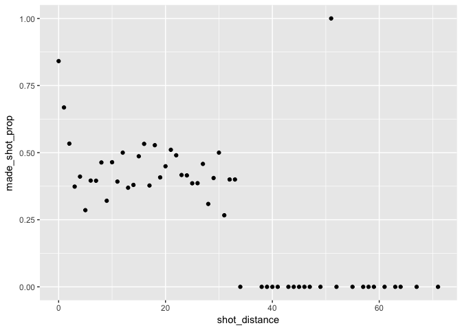

HW02 - Shot Charts
================
Sizhuo (Cindy) Liu
February 28, 2018

### 5. Summary Tables

``` r
library(dplyr)
```

    ## 
    ## Attaching package: 'dplyr'

    ## The following objects are masked from 'package:stats':
    ## 
    ##     filter, lag

    ## The following objects are masked from 'package:base':
    ## 
    ##     intersect, setdiff, setequal, union

``` r
library(ggplot2)
```

#### 5.1 Total Shots by Players

``` r
# total number of shots made by players, arranged in descending order
shots_data <- read.csv('../data/shots-data.csv', stringsAsFactors = FALSE)

shots_data %>%
  group_by(name) %>%
  summarise(total_shots = length(shot_type)) %>%
  arrange(desc(total_shots))
```

    ## # A tibble: 5 x 2
    ##   name           total_shots
    ##   <chr>                <int>
    ## 1 Stephen Curry         1250
    ## 2 Klay Thompson         1220
    ## 3 Kevin Durant           915
    ## 4 Draymond Green         578
    ## 5 Andre Iguodala         371

#### 5.2 Effective Shooting Percentage

``` r
# effective shooting percentage by player
merge(shots_data %>%
  group_by(name) %>%
  summarise(total_shots = length(shot_type)),
  shots_data%>%
  group_by(name) %>%
  filter(shot_made_flag == 'made shot') %>%
  summarise(made_shots = length(shot_made_flag))) %>%
  mutate(perc_made = made_shots / total_shots) %>%
  arrange(desc(perc_made))
```

    ##             name total_shots made_shots perc_made
    ## 1   Kevin Durant         915        495 0.5409836
    ## 2 Andre Iguodala         371        192 0.5175202
    ## 3  Klay Thompson        1220        575 0.4713115
    ## 4  Stephen Curry        1250        584 0.4672000
    ## 5 Draymond Green         578        245 0.4238754

``` r
# 2PT effective shooting percentage by player
merge(shots_data %>%
  group_by(name) %>%
    filter(shot_type == '2PT Field Goal') %>%
    summarise(total_shots = length(shot_type)),
  shots_data%>%
  group_by(name) %>%
  filter(shot_made_flag == 'made shot') %>%
    filter(shot_type == '2PT Field Goal') %>%
    summarise(made_shots = length(shot_type))) %>%
  mutate(perc_made = made_shots / total_shots) %>%
  arrange(desc(perc_made))
```

    ##             name total_shots made_shots perc_made
    ## 1 Andre Iguodala         210        134 0.6380952
    ## 2   Kevin Durant         643        390 0.6065319
    ## 3  Stephen Curry         563        304 0.5399645
    ## 4  Klay Thompson         640        329 0.5140625
    ## 5 Draymond Green         346        171 0.4942197

``` r
# 3PT effective shooting percentage by player
merge(shots_data %>%
  group_by(name) %>%
    filter(shot_type == '3PT Field Goal') %>%
    summarise(total_shots = length(shot_type)),
  shots_data%>%
  group_by(name) %>%
  filter(shot_made_flag == 'made shot') %>%
    filter(shot_type == '3PT Field Goal') %>%
    summarise(made_shots = length(shot_type))) %>%
  mutate(perc_made = made_shots / total_shots) %>%
  arrange(desc(perc_made))
```

    ##             name total_shots made_shots perc_made
    ## 1  Klay Thompson         580        246 0.4241379
    ## 2  Stephen Curry         687        280 0.4075691
    ## 3   Kevin Durant         272        105 0.3860294
    ## 4 Andre Iguodala         161         58 0.3602484
    ## 5 Draymond Green         232         74 0.3189655

#### 6. Shooting Distance

##### 6.1 dplyr Table

``` r
# create new tibble using dplyr functions
tibble1 <- merge(shots_data %>%
  group_by(shot_distance) %>%
  summarise(total_shot1 = length(shot_made_flag)),
  shots_data %>%
  group_by(shot_distance) %>%
    summarise(made_shot1 = sum(shot_made_flag == 'made shot'))) %>%
      group_by(shot_distance) %>%
  summarise(made_shot_prop = made_shot1 / total_shot1) 
tibble1
```

    ## # A tibble: 56 x 2
    ##    shot_distance made_shot_prop
    ##            <int>          <dbl>
    ##  1             0          0.841
    ##  2             1          0.668
    ##  3             2          0.534
    ##  4             3          0.373
    ##  5             4          0.411
    ##  6             5          0.286
    ##  7             6          0.396
    ##  8             7          0.395
    ##  9             8          0.463
    ## 10             9          0.321
    ## # ... with 46 more rows

##### 6.2 ggplot

``` r
# create a scatterplot based on the tibble in 6.1
ggplot(data = tibble1, aes(x=shot_distance, y=made_shot_prop)) +
  geom_point()
```



##### Observation of the Pattern of the Graph

-   The scatterplot shows that shots made at the distances between 0 and 2 away from the goal have the highest chance of being successful, with a proportion of around 50% to 80%. The percentage drops below 50% when the distance goes above 3 to around 25%-50%. The chance that a shot is being made successful at a distance above 33 drops drastically to almost zero.
-   We can confirm that the shorter the distance the more effective the shots as the made\_shot\_proportion becomes smaller and smaller as the shot distance increases.
-   According to the graph, the estimated distance threshold beyond which the chance of making a successful shot is null is anything above 30.
-   Distances of 0-2, 12, 16, 18, and 21 tend to have a made\_shot\_prop of 50% or more.

#### 7. Total Number of Shots by Minute of Occurrence

``` r
# create a facetted graph of the total number of shots by minute of occurrence

# reorganize data
shots1 <-shots_data %>%
  select(minute,name) %>%
  filter(name== 'Andre Iguodala') %>%
  group_by(minute) %>%
  summarise (number_of_shots = length(name == name)) %>%
  mutate(name = 'Andre Iguodala')
shots2 <-shots_data %>%
  select(minute,name) %>%
  filter(name== 'Draymond Green') %>%
  group_by(minute) %>%
  summarise (number_of_shots = length(name == name)) %>%
  mutate(name = 'Draymond Green')
shots3 <-shots_data %>%
  select(minute,name) %>%
  filter(name== 'Kevin Durant') %>%
  group_by(minute) %>%
  summarise (number_of_shots = length(name == name)) %>%
  mutate(name = 'Kevin Durant')
shots4 <-shots_data %>%
  select(minute,name) %>%
  filter(name== 'Klay Thompson') %>%
  group_by(minute) %>%
  summarise (number_of_shots = length(name == name)) %>%
  mutate(name = 'Klay Thompson')
shots5 <-shots_data %>%
  select(minute,name) %>%
  filter(name== 'Stephen Curry') %>%
  group_by(minute) %>%
  summarise (number_of_shots = length(name == name)) %>%
  mutate(name = 'Stephen Curry')
shots_overall <- rbind(shots1,shots2,shots3,shots4,shots5)
shots_overall
```

    ## # A tibble: 233 x 3
    ##    minute number_of_shots name          
    ##     <int>           <int> <chr>         
    ##  1      4               1 Andre Iguodala
    ##  2      5               1 Andre Iguodala
    ##  3      6               1 Andre Iguodala
    ##  4      7               7 Andre Iguodala
    ##  5      8              10 Andre Iguodala
    ##  6      9              11 Andre Iguodala
    ##  7     10              17 Andre Iguodala
    ##  8     11              10 Andre Iguodala
    ##  9     12              23 Andre Iguodala
    ## 10     13              10 Andre Iguodala
    ## # ... with 223 more rows

``` r
# plot facetted graph
ggplot(data = shots_overall,aes(x = minute, y =number_of_shots)) + 
  geom_rect(xmin = 0,xmax = 12,ymin = 0,ymax = 60, alpha = 0.005, col = 'grey96') +
  geom_rect(xmin = 24,xmax = 36,ymin = 0,ymax = 60, alpha = 0.005, col = 'grey96') +
  geom_point(col = 'dodgerblue2', alpha = 0.8) +
  geom_path(col = 'dodgerblue2', alpha = 0.5) +
  scale_x_continuous()+
  facet_wrap(~name) +
  theme_minimal()
```


