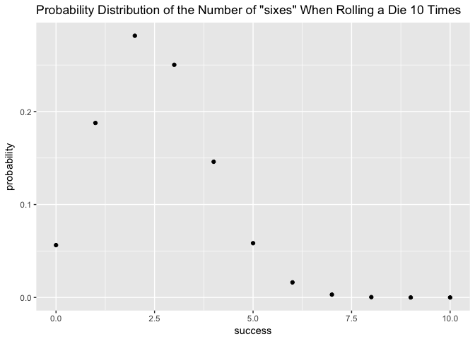
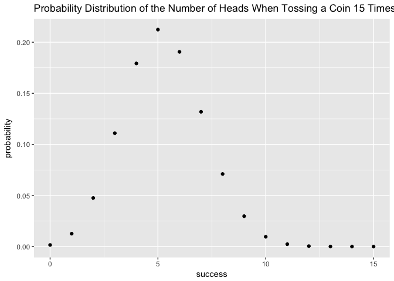

hw03-Sizhuo(Cindy)-Liu
================
Sizhuo (Cindy) Liu
March 17, 2018

### 2. Pipelines and Redirection

#### Piping

##### 2.1 Write a pipeline to obtain the unique team names, and redirect the output to a text file team-names.txt

``` bash
# select second column (team) 
# sort by team 
# list unique occurrences based on team name 
# redirect the output to a new textfile 
cut -d ',' -f 2 nba2017-roster.csv | sort | sort -u > team-names.txt

# display the first five lines of the created file
head -5 team-names.txt
```

    ## "ATL"
    ## "BOS"
    ## "BRK"
    ## "CHI"
    ## "CHO"

##### 2.2 Write a pipeline to obtain the unique positions, and redirect the output to a text file position-names.txt

``` bash
# select third column (position) 
# sort by position
# list unique occurrences based on position name 
# redirect the output to a new textfile 
cut -d ',' -f 3 nba2017-roster.csv | sort | sort -u > position-names.txt

# display the first five lines of the created file
head -5 position-names.txt
```

    ## "C"
    ## "PF"
    ## "PG"
    ## "SF"
    ## "SG"

##### 2.3 Write a pipeline to obtain the counts (i.e. frequencies) of the different experience values, displayed from largest to smallest (i.e. descending order). Redirect the output to a text file experience-counts.txt

``` bash
# select seventh column (experience) 
# list unique occurrences based on experience value 
# get rid of the first line (column name)
# display counts of unique values in descending order
# redirect the output to a new textfile 
cut -d ',' -f 7 nba2017-roster.csv | sort -n | tail +2 | uniq -c > experience-counts.txt

# display the first five lines of the created file
head -5 experience-counts.txt
```

    ##   80 0
    ##   52 1
    ##   46 2
    ##   36 3
    ##   35 4

##### 2.4 Use output redirection commands to create a CSV file LAC.csv containing data for the LAC team (Los Angeles Clippers), including column names.

``` bash
# filter out data for LAC players with column names
# redirecct the output to a new csv file
grep -E 'LAC|player' nba2017-roster.csv > LAC.csv 

# display the content of the created file
cat LAC.csv
```

    ## "player","team","position","height","weight","age","experience","salary"
    ## "Alan Anderson","LAC","SF",78,220,34,7,1315448
    ## "Austin Rivers","LAC","SG",76,200,24,4,1.1e+07
    ## "Blake Griffin","LAC","PF",82,251,27,6,20140838
    ## "Brandon Bass","LAC","PF",80,250,31,11,1551659
    ## "Brice Johnson","LAC","PF",82,230,22,0,1273920
    ## "Chris Paul","LAC","PG",72,175,31,11,22868828
    ## "DeAndre Jordan","LAC","C",83,265,28,8,21165675
    ## "Diamond Stone","LAC","C",83,255,19,0,543471
    ## "J.J. Redick","LAC","SG",76,190,32,10,7377500
    ## "Jamal Crawford","LAC","SG",77,200,36,16,13253012
    ## "Luc Mbah a Moute","LAC","SF",80,230,30,8,2203000
    ## "Marreese Speights","LAC","C",82,255,29,8,1403611
    ## "Paul Pierce","LAC","SF",79,235,39,18,3500000
    ## "Raymond Felton","LAC","PG",73,205,32,11,1551659
    ## "Wesley Johnson","LAC","SF",79,215,29,6,5628000

##### 2.5 Write a pipeline to display the age frequencies of LAL players. The first column corresponds to count, the second column corresponds to age

``` bash
# filter out all rows representing LAL players 
# select sixth column (age) 
# list unique occurrences based on age
# get rid of the first line (column name)
# display counts of unique values in descending order
grep -E 'LAL|player' nba2017-roster.csv | cut -d ',' -f 6 | sort -n | tail +2 | uniq -c 
```

    ##    2 19
    ##    1 20
    ##    2 22
    ##    3 24
    ##    2 25
    ##    2 30
    ##    2 31
    ##    1 37

##### 2.6 Write a pipeline to find the number of players in CLE (Cleveland) team; the output should be just the number of players

``` bash
# filter out all rows representing CLE players 
# count the number of lines
grep --word-regexp 'CLE' nba2017-roster.csv | wc -l
```

    ##       15

##### 2.7 Write pipelines to create a CSV file gsw-height-weight.csv that contains the player, height and weight of GSW players and includes column names

``` bash
# filter out all rows representing GSW players
# select columns corresponding to player names, heights, and weights
# redirect the output to a new csv file
grep -E 'GSW|player' nba2017-roster.csv | cut -d ',' -f 1,4,5 > gsw-height-weight.csv

# display the content of the new csv file
cat gsw-height-weight.csv
```

    ## "player","height","weight"
    ## "Andre Iguodala",78,215
    ## "Damian Jones",84,245
    ## "David West",81,250
    ## "Draymond Green",79,230
    ## "Ian Clark",75,175
    ## "James Michael McAdoo",81,230
    ## "JaVale McGee",84,270
    ## "Kevin Durant",81,240
    ## "Kevon Looney",81,220
    ## "Klay Thompson",79,215
    ## "Matt Barnes",79,226
    ## "Patrick McCaw",79,185
    ## "Shaun Livingston",79,192
    ## "Stephen Curry",75,190
    ## "Zaza Pachulia",83,270

##### 2.8 Write pipelines to create a file top10-salaries.csv containing the top10 player salaries, arranged by salary from largest to smallest. Your CSV file should include column names

``` bash
cut -d ',' -f 1,8 nba2017-roster.csv | sort -r -k2 -n -t, | head -10 > top10-salaries.csv
sed -i '' '1i\ 
"player","salary"
' top10-salaries.csv
cat top10-salaries.csv
```

    ## "player","salary"
    ## "LeBron James",30963450
    ## "Russell Westbrook",26540100
    ## "Mike Conley",26540100
    ## "Kevin Durant",26540100
    ## "James Harden",26540100
    ## "DeMar DeRozan",26540100
    ## "Al Horford",26540100
    ## "Carmelo Anthony",24559380
    ## "Damian Lillard",24328425
    ## "Dwyane Wade",23200000

``` bash
grep 'player' nba2017-roster.csv | cut -d ',' -f 1,8 > top10-salaries.csv
cut -d ',' -f 1,8 nba2017-roster.csv | sort -r -k2 -n -t, | head -10 >> top10-salaries.csv
cat top10-salaries.csv
```

    ## "player","salary"
    ## "LeBron James",30963450
    ## "Russell Westbrook",26540100
    ## "Mike Conley",26540100
    ## "Kevin Durant",26540100
    ## "James Harden",26540100
    ## "DeMar DeRozan",26540100
    ## "Al Horford",26540100
    ## "Carmelo Anthony",24559380
    ## "Damian Lillard",24328425
    ## "Dwyane Wade",23200000

#### Source Binomial Functions

``` r
source(file='./code/binomial-functions.R')
```

##### Assume that the “successful” event is getting a “six” when rolling a die. Consider rolling a fair die 10 times. Use bin\_probability() to find the probability of getting exactly 3 sixes

``` r
bin_probability(trials=10, success=3, prob=1/6)
```

    ## [1] 0.1550454

##### Use bin\_distribution() to obtain the distribution of the number of “sixes” when rolling a loaded die 10 times, in which the number “six” has probability of 0.25. Make a plot of this distribution

``` r
#ask
bin_distribution(trials=10, prob=0.25)
```

    ##    success  probability
    ## 1        0 5.631351e-02
    ## 2        1 1.877117e-01
    ## 3        2 2.815676e-01
    ## 4        3 2.502823e-01
    ## 5        4 1.459980e-01
    ## 6        5 5.839920e-02
    ## 7        6 1.622200e-02
    ## 8        7 3.089905e-03
    ## 9        8 3.862381e-04
    ## 10       9 2.861023e-05
    ## 11      10 9.536743e-07

``` r
library(ggplot2)
ggplot(bin_distribution(trials=10, prob=0.25), aes(x=success,y=probability)) +
  geom_point() +
  ggtitle('Probability Distribution of the Number of "sixes" When Rolling a Die 10 Times')
```



##### Use bin\_probability(), and a for loop, to obtain the probability of getting more than 3 heads in 5 tosses with a biased coin of 35% chance of heads

``` r
bin_prob <- rep(0, 2)
k <- 3
for (i in 1:2) {
  k <- k + 1
  bin_prob[i] <- bin_probability(trials=5, success=k, prob=0.35)
  
}
sum(bin_prob)
```

    ## [1] 0.0540225

##### Use bin\_distribution() to obtain the probability distribution of the number of heads when tossing a loaded coin 15 times, with 35% chance of heads. Make a plot of this distribution

``` r
bin_distribution(trials=15, prob=0.35)
```

    ##    success  probability
    ## 1        0 1.562069e-03
    ## 2        1 1.261672e-02
    ## 3        2 4.755531e-02
    ## 4        3 1.109624e-01
    ## 5        4 1.792469e-01
    ## 6        5 2.123387e-01
    ## 7        6 1.905604e-01
    ## 8        7 1.319264e-01
    ## 9        8 7.103729e-02
    ## 10       9 2.975066e-02
    ## 11      10 9.611752e-03
    ## 12      11 2.352527e-03
    ## 13      12 4.222484e-04
    ## 14      13 5.246873e-05
    ## 15      14 4.036056e-06
    ## 16      15 1.448841e-07

``` r
ggplot(bin_distribution(trials=15, prob=0.35), aes(x=success,y=probability)) +
  geom_point() +
  ggtitle('Probability Distribution of the Number of Heads When Tossing a Coin 15 Times')
```


