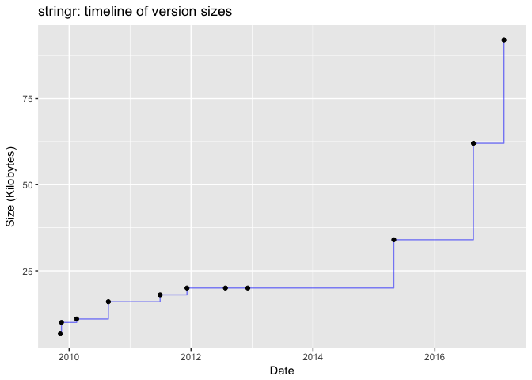
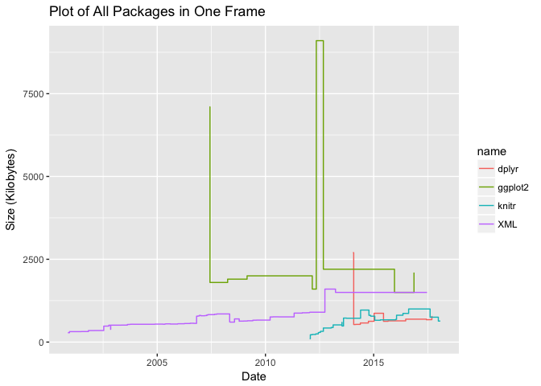
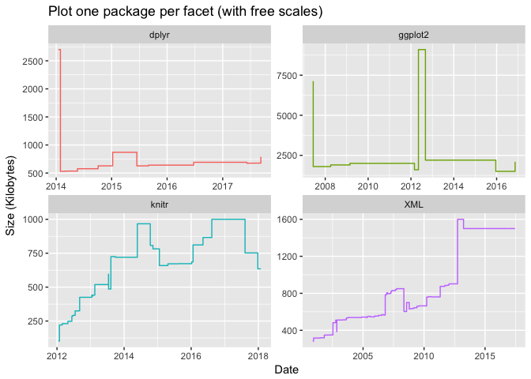
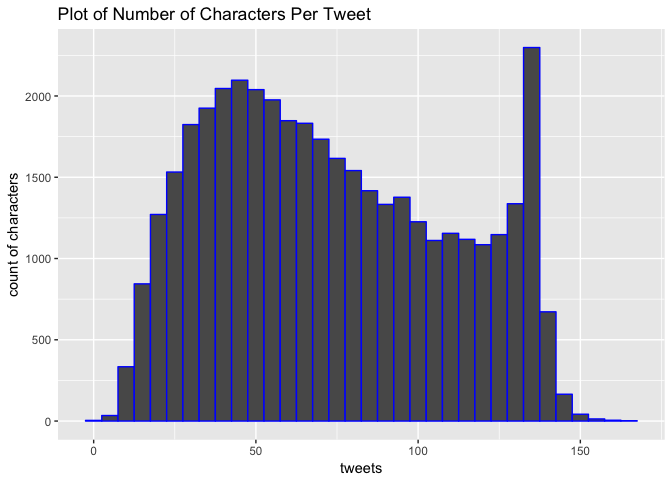
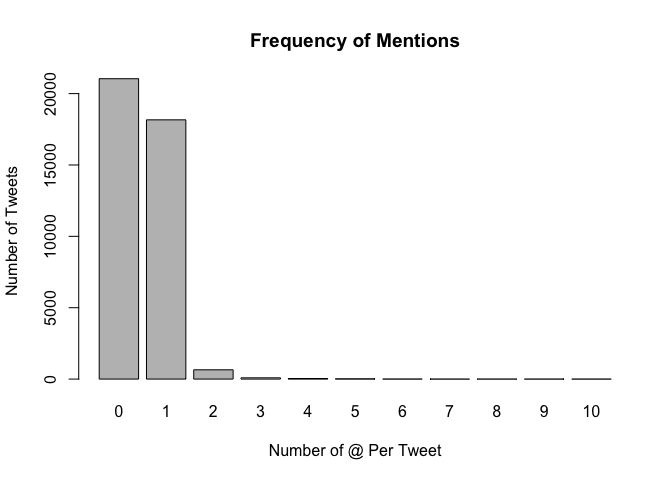
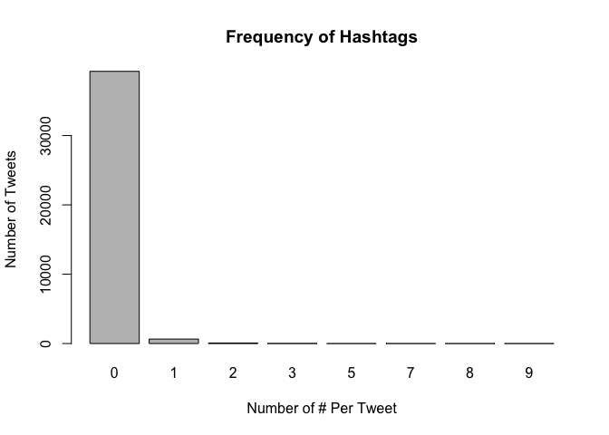

hw04-Sizhuo(Cindy)-Liu
================
Sizhuo (Cindy) Liu
April 10, 2018

``` r
# load packages
library(ggplot2)
library(stringr)
```

``` r
source(file='../code/archive-functions.R')
```

### 1.4) Archive of 'stringr'

``` r
raw_data <- read_archive('stringr')
clean_data <- clean_archive(raw_data)
plot_archive(clean_data)
```



### 1.5) Archives of "dplyr", "ggplot2", "XML", and "knitr"

``` r
# CRAN archive table for 'ggplot2'
ggplot2 <- clean_archive(read_archive('ggplot2'))
ggplot2
```

    ##       name version       date size
    ## 1  ggplot2   0.5.1 2007-06-10 1800
    ## 2  ggplot2   0.5.2 2007-06-18 1800
    ## 3  ggplot2   0.5.4 2007-07-08 1800
    ## 4  ggplot2   0.5.5 2007-09-01 1800
    ## 5  ggplot2   0.5.6 2007-10-20 1800
    ## 6  ggplot2   0.5.7 2008-01-11 1800
    ## 7  ggplot2     0.5 2007-06-01 7100
    ## 8  ggplot2     0.6 2008-04-03 1900
    ## 9  ggplot2     0.7 2008-10-05 1900
    ## 10 ggplot2   0.8.1 2008-12-14 1900
    ## 11 ggplot2   0.8.2 2009-02-25 2000
    ## 12 ggplot2   0.8.3 2009-04-20 2000
    ## 13 ggplot2   0.8.4 2009-12-09 2000
    ## 14 ggplot2   0.8.5 2009-12-16 2000
    ## 15 ggplot2   0.8.6 2010-02-18 2000
    ## 16 ggplot2   0.8.7 2010-03-02 2000
    ## 17 ggplot2   0.8.8 2010-07-05 2000
    ## 18 ggplot2   0.8.9 2010-12-23 2000
    ## 19 ggplot2     0.8 2008-11-21 1900
    ## 20 ggplot2   0.9.0 2012-03-01 1600
    ## 21 ggplot2   0.9.1 2012-05-08 9100
    ## 22 ggplot2 0.9.2.1 2012-09-11 2200
    ## 23 ggplot2   0.9.2 2012-09-04 2200
    ## 24 ggplot2 0.9.3.1 2013-03-02 2200
    ## 25 ggplot2   0.9.3 2012-12-05 2200
    ## 26 ggplot2   1.0.0 2014-05-21 2200
    ## 27 ggplot2   1.0.1 2015-03-17 2200
    ## 28 ggplot2   2.0.0 2015-12-18 1500
    ## 29 ggplot2   2.1.0 2016-03-01 1500
    ## 30 ggplot2   2.2.0 2016-11-11 2100

``` r
write.csv(ggplot2, file = '../data/ggplot2-archive.csv', row.names = FALSE)
```

``` r
# CRAN archive table for 'XML'
XML <- clean_archive(read_archive('XML'))
XML
```

    ##     name  version       date size
    ## 1    XML      0.2 2000-11-15  283
    ## 2    XML    0.3-3 2000-12-12  316
    ## 3    XML    0.6-1 2001-06-28  319
    ## 4    XML    0.6-2 2001-06-28  318
    ## 5    XML    0.6-3 2001-07-11  319
    ## 6    XML    0.7-0 2001-10-28  348
    ## 7    XML    0.7-1 2001-10-30  348
    ## 8    XML    0.7-2 2001-11-29  348
    ## 9    XML    0.7-3 2002-02-01  348
    ## 10   XML    0.7-4 2002-02-08  349
    ## 11   XML    0.7-5 2002-03-27  349
    ## 12   XML    0.8-0 2002-04-26  349
    ## 13   XML    0.8-2 2002-05-10  350
    ## 14   XML    0.9-0 2002-07-14  482
    ## 15   XML    0.9-1 2002-08-30  483
    ## 16   XML   0.92-1 2002-10-07  510
    ## 17   XML   0.92-2 2002-10-12  510
    ## 18   XML   0.93-0 2002-11-06  385
    ## 19   XML   0.93-1 2002-11-08  511
    ## 20   XML   0.93-2 2003-03-05  511
    ## 21   XML   0.93-3 2003-03-09  511
    ## 22   XML   0.93-4 2003-05-04  513
    ## 23   XML   0.94-0 2003-08-15  515
    ## 24   XML   0.94-1 2003-08-17  532
    ## 25   XML   0.95-0 2003-09-23  535
    ## 26   XML   0.95-1 2003-10-01  535
    ## 27   XML   0.95-3 2003-10-07  538
    ## 28   XML   0.95-4 2003-10-28  539
    ## 29   XML   0.95-6 2003-11-26  538
    ## 30   XML   0.97-0 2004-11-22  543
    ## 31   XML   0.97-3 2005-04-08  539
    ## 32   XML   0.97-4 2005-05-09  546
    ## 33   XML   0.97-6 2005-05-21  550
    ## 34   XML   0.97-7 2005-06-02  551
    ## 35   XML   0.97-8 2005-08-10  545
    ## 36   XML   0.99-2 2005-12-12  552
    ## 37   XML   0.99-4 2005-12-16  553
    ## 38   XML   0.99-5 2005-12-21  554
    ## 39   XML   0.99-6 2006-01-01  554
    ## 40   XML   0.99-7 2006-04-05  561
    ## 41   XML   0.99-8 2006-07-10  569
    ## 42   XML  0.99-92 2006-09-11  565
    ## 43   XML  0.99-93 2006-09-15  565
    ## 44   XML    1.1-1 2006-10-27  782
    ## 45   XML    1.2-0 2006-11-15  787
    ## 46   XML    1.3-2 2006-12-10  805
    ## 47   XML    1.4-0 2006-12-16  805
    ## 48   XML    1.4-1 2007-01-07  795
    ## 49   XML    1.5-1 2007-03-14  797
    ## 50   XML    1.6-0 2007-03-15  798
    ## 51   XML    1.6-2 2007-03-27  801
    ## 52   XML    1.6-3 2007-04-06  801
    ## 53   XML    1.7-1 2007-04-18  820
    ## 54   XML    1.7-2 2007-04-23  820
    ## 55   XML    1.7-3 2007-04-26  821
    ## 56   XML    1.9-0 2007-05-10  829
    ## 57   XML   1.92-0 2007-08-25  840
    ## 58   XML   1.92-1 2007-09-01  840
    ## 59   XML   1.93-1 2007-10-01  849
    ## 60   XML   1.93-2 2007-10-03  850
    ## 61   XML   1.95-1 2008-05-07  609
    ## 62   XML   1.95-2 2008-05-13  603
    ## 63   XML   1.95-3 2008-06-27  603
    ## 64   XML   1.96-0 2008-07-28  700
    ## 65   XML   1.98-0 2008-10-15  630
    ## 66   XML   1.98-1 2008-10-20  633
    ## 67   XML   1.99-0 2008-12-30  636
    ## 68   XML    2.1-0 2009-02-19  638
    ## 69   XML    2.3-0 2009-03-06  644
    ## 70   XML    2.5-0 2009-06-02  660
    ## 71   XML    2.5-1 2009-06-07  660
    ## 72   XML    2.5-3 2009-06-25  661
    ## 73   XML    2.6-0 2009-08-04  664
    ## 74   XML    2.8-1 2010-03-21  759
    ## 75   XML    3.1-0 2010-05-08  763
    ## 76   XML    3.1-1 2010-08-12  761
    ## 77   XML    3.2-0 2010-10-05  761
    ## 78   XML    3.4-0 2011-04-30  875
    ## 79   XML    3.4-2 2011-08-04  875
    ## 80   XML    3.4-3 2011-09-14  885
    ## 81   XML    3.6-0 2011-11-29  887
    ## 82   XML    3.6-1 2011-11-30  887
    ## 83   XML    3.6-2 2011-12-09  887
    ## 84   XML    3.7-2 2012-01-08  890
    ## 85   XML    3.7-3 2012-01-11  890
    ## 86   XML    3.7-4 2012-01-12  890
    ## 87   XML    3.8-0 2012-01-14  894
    ## 88   XML    3.9-0 2012-01-18  901
    ## 89   XML    3.9-2 2012-01-21  902
    ## 90   XML    3.9-4 2012-01-31  902
    ## 91   XML 3.95-0.1 2012-10-02 1600
    ## 92   XML 3.95-0.2 2013-03-07 1600
    ## 93   XML   3.95-0 2012-09-30 1600
    ## 94   XML 3.96-0.1 2013-03-20 1600
    ## 95   XML 3.96-0.2 2013-03-21 1600
    ## 96   XML 3.96-1.1 2013-03-28 1500
    ## 97   XML 3.98-1.1 2013-06-20 1500
    ## 98   XML 3.98-1.2 2015-05-31 1500
    ## 99   XML 3.98-1.3 2015-06-30 1500
    ## 100  XML 3.98-1.4 2016-03-01 1500
    ## 101  XML 3.98-1.5 2016-11-10 1500
    ## 102  XML 3.98-1.6 2017-03-30 1500
    ## 103  XML 3.98-1.7 2017-05-03 1500
    ## 104  XML 3.98-1.8 2017-06-15 1500
    ## 105  XML 3.98-1.9 2017-06-19 1500

``` r
write.csv(XML, file = '../data/xml-archive.csv', row.names = FALSE)
```

``` r
# CRAN archive table for 'knitr'
knitr <- clean_archive(read_archive('knitr'))
knitr
```

    ##     name version       date size
    ## 1  knitr     0.1 2012-01-17  102
    ## 2  knitr     0.2 2012-01-28  221
    ## 3  knitr     0.3 2012-02-28  231
    ## 4  knitr     0.4 2012-04-29  236
    ## 5  knitr     0.5 2012-04-29  248
    ## 6  knitr   0.6.3 2012-06-22  292
    ## 7  knitr     0.6 2012-06-11  286
    ## 8  knitr     0.7 2012-07-17  325
    ## 9  knitr     0.8 2012-09-04  425
    ## 10 knitr     0.9 2013-01-20  431
    ## 11 knitr   1.0.5 2013-01-21  441
    ## 12 knitr     1.0 2013-01-14  441
    ## 13 knitr     1.1 2013-02-16  519
    ## 14 knitr     1.2 2013-07-16  486
    ## 15 knitr     1.3 2013-07-15  595
    ## 16 knitr   1.4.1 2013-08-12  725
    ## 17 knitr     1.4 2013-08-10  725
    ## 18 knitr     1.5 2013-09-28  720
    ## 19 knitr     1.6 2014-05-25  967
    ## 20 knitr     1.7 2014-10-13  807
    ## 21 knitr     1.8 2014-11-11  782
    ## 22 knitr     1.9 2015-01-20  659
    ## 23 knitr  1.10.5 2015-05-06  672
    ## 24 knitr    1.10 2015-04-23  672
    ## 25 knitr    1.11 2015-08-14  673
    ## 26 knitr  1.12.3 2016-01-22  811
    ## 27 knitr    1.12 2016-01-07  686
    ## 28 knitr    1.13 2016-05-09  866
    ## 29 knitr    1.14 2016-08-13 1000
    ## 30 knitr  1.15.1 2016-11-22 1000
    ## 31 knitr    1.15 2016-11-09 1000
    ## 32 knitr    1.16 2017-05-18 1000
    ## 33 knitr    1.17 2017-08-10  752
    ## 34 knitr    1.18 2017-12-27  635
    ## 35 knitr    1.19 2018-01-29  635

``` r
write.csv(knitr, file = '../data/knitr-archive.csv', row.names = FALSE)
```

``` r
# CRAN archive table for 'dplyr'
dplyr <- clean_archive(read_archive('dplyr'))
dplyr
```

    ##     name version       date size
    ## 1  dplyr   0.1.1 2014-01-29  530
    ## 2  dplyr   0.1.2 2014-02-24  533
    ## 3  dplyr   0.1.3 2014-03-15  535
    ## 4  dplyr     0.1 2014-01-16 2700
    ## 5  dplyr     0.2 2014-05-21  577
    ## 6  dplyr 0.3.0.1 2014-10-08  629
    ## 7  dplyr 0.3.0.2 2014-10-11  628
    ## 8  dplyr     0.3 2014-10-04  629
    ## 9  dplyr   0.4.0 2015-01-08  870
    ## 10 dplyr   0.4.1 2015-01-14  870
    ## 11 dplyr   0.4.2 2015-06-16  628
    ## 12 dplyr   0.4.3 2015-09-01  641
    ## 13 dplyr   0.5.0 2016-06-24  692
    ## 14 dplyr   0.7.0 2017-06-09  675
    ## 15 dplyr   0.7.1 2017-06-22  676
    ## 16 dplyr   0.7.2 2017-07-21  677
    ## 17 dplyr   0.7.3 2017-09-09  789

``` r
write.csv(dplyr, file = '../data/dplyr-archive.csv', row.names = FALSE)
```

#### Plot All Packages in One Frame

``` r
combined <- rbind(dplyr, ggplot2, knitr, XML)
ggplot(data=combined, aes(x=date, y=size, group = name, colour = name)) +
    geom_step() +
  labs(x = 'Date', y = 'Size (Kilobytes)', title = 'Plot of All Packages in One Frame')
```



``` r
combined <- rbind(dplyr, ggplot2, knitr, XML)
ggplot(data = combined) +
    labs(x = 'Date', y = 'Size (Kilobytes)', title = 'Plot one package per facet (with free scales)') +
    geom_step(aes(x = date, y = size, color = name)) +
  facet_wrap(~name, scales ='free') +
  theme(legend.position = 'none')
```



### 3) Data "Emotion in Text"

``` r
# load data
dat <- read.csv(file = '../data/text-emotion.csv', stringsAsFactors = FALSE)
head(dat, n=10)
```

    ##      tweet_id  sentiment        author
    ## 1  1956967341      empty    xoshayzers
    ## 2  1956967666    sadness     wannamama
    ## 3  1956967696    sadness     coolfunky
    ## 4  1956967789 enthusiasm   czareaquino
    ## 5  1956968416    neutral     xkilljoyx
    ## 6  1956968477      worry xxxPEACHESxxx
    ## 7  1956968487    sadness      ShansBee
    ## 8  1956968636      worry      mcsleazy
    ## 9  1956969035    sadness   nic0lepaula
    ## 10 1956969172    sadness    Ingenue_Em
    ##                                                                                                                                 content
    ## 1                                          @tiffanylue i know  i was listenin to bad habit earlier and i started freakin at his part =[
    ## 2                                                                          Layin n bed with a headache  ughhhh...waitin on your call...
    ## 3                                                                                                   Funeral ceremony...gloomy friday...
    ## 4                                                                                                  wants to hang out with friends SOON!
    ## 5                                                @dannycastillo We want to trade with someone who has Houston tickets, but no one will.
    ## 6                                                  Re-pinging @ghostridah14: why didn't you go to prom? BC my bf didn't like my friends
    ## 7  I should be sleep, but im not! thinking about an old friend who I want. but he's married now. damn, &amp; he wants me 2! scandalous!
    ## 8                                                                                                  Hmmm. http://www.djhero.com/ is down
    ## 9                                                                                               @charviray Charlene my love. I miss you
    ## 10                                                                                           @kelcouch I'm sorry  at least it's Friday?

#### 3.1) Count the Number of Characters Per Tweet

``` r
content_char_count <- nchar(dat$content)

# summary for the count of characters in tweet content
summary(content_char_count)
```

    ##    Min. 1st Qu.  Median    Mean 3rd Qu.    Max. 
    ##    1.00   43.00   69.00   73.41  103.00  167.00

``` r
ggplot(data = as.data.frame(content_char_count), aes(x = content_char_count), col= 'black') + 
    geom_histogram(binwidth = 5, color = 'blue') + 
  labs(x = 'tweets', y = 'count of characters', title = 'Plot of Number of Characters Per Tweet')
```



#### 3.2) Number of Mentions

``` r
# count the number of hashtags in the tweet contents
row_id <- str_extract_all(dat$content, '\\@\\w+')
count_id <- rep(0)
for (i in 1:length(dat$content)) {
  if(sum(nchar(row_id[[i]]) <= 16 & nchar(row_id[[i]]) != 0) >= 1) {
    count_id[i] <- length(row_id[[i]])
  } else {
    count_id[i] <- 0
  }
}

# table of summary (display of frequency)
table(count_id)
```

    ## count_id
    ##     0     1     2     3     4     5     6     7     8     9    10 
    ## 21043 18162   649    86    34    16     5     1     2     1     1

``` r
# barplot of the counts
barplot(table(count_id), main = 'Frequency of Mentions', xlab = 'Number of @ Per Tweet', ylab = 'Number of Tweets')
```



``` r
# display the content of the tweet with ten mentions
vec_fac<- as.factor(count_id)
vec_string <- paste(vec_fac, sep = ' ')
dat$content[str_which(vec_string, '10')]
```

    ## [1] "last #ff  @Mel_Diesel @vja4041 @DemonFactory @shawnmcguirt @SEO_Web_Design @ChuckSwanson @agracing @confidentgolf @tluckow @legalblonde31"

#### 3.3) Hashtags

``` r
# number of elements containing '#'
a <- str_extract_all(dat$content, '#[:alpha:][:alnum:]*')
count_hashtag <- rep(0)
for (i in 1:length(dat$content)) {
  if(length(a[[i]]) >= 1) {
    count_hashtag[i] <- length(a[[i]])
  } else {
    count_hashtag[i] <- 0
  }
}

# table of summary (display of frequency)
table(count_hashtag)
```

    ## count_hashtag
    ##     0     1     2     3     5     7     8     9 
    ## 39261   650    66    17     1     1     1     3

``` r
# barplot of frequency
barplot(table(count_hashtag), main = 'Frequency of Hashtags', xlab = 'Number of # Per Tweet', ylab = 'Number of Tweets')
```



``` r
# average length of the hashtags
hashtags <- unlist(
  lapply(a, function(y) if (length(y) == 0) NULL else y [[1]])
)
hash_length <- str_count(hashtags) - 1
summary(hash_length)
```

    ##    Min. 1st Qu.  Median    Mean 3rd Qu.    Max. 
    ##   1.000   4.000   7.000   7.714  11.000  34.000

``` r
# from the summary, the average length of hashtags is 7.714


# the most common length (i.e. the mode) of the hashtags
table(hash_length)
```

    ## hash_length
    ##  1  2  3  4  5  6  7  8  9 10 11 12 13 14 15 16 17 18 19 20 21 22 34 
    ##  1 69 61 75 63 45 64 62 57 48 53 57 18 18 24  7  6  3  2  2  2  1  1

``` r
# from the table, the most common length of the hashtags is 4
```
