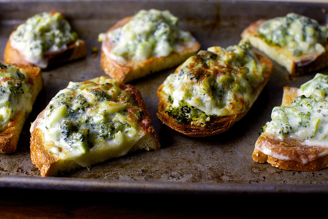

Warm-Up 01
================
Sizhuo(Cindy) Liu
January 24, 2018

**Game of Thrones**
===================

### Character: Bran Stark

#### *Character's Quote:*

> "I need to learn to see better. When the Long Night comes again...I need to be ready"

#### *Image of Character:*

| Bran Stark    | Information                            |
|---------------|----------------------------------------|
| Status        | Alive                                  |
| Age           | 16 in Season 7                         |
| Date of Birth | 288 AC                                 |
| Origin        | Winterfell                             |
| Allegiance    | House Stark                            |
| Predecessor   | {Unnamed greenseer} (Three-eyed raven) |
| Successor     | N/A                                    |
| Culture       | Northmen                               |
| Religion      | Old Gods of the Forest                 |
| Father        | {Eddard Stark}                         |
| Mother        | {Catelyn Stark}                        |

**Cooking Recipe**
==================

### Dish: Broccoli Melts

#### *Ingredients:*

-   1 pound of regular broccoli
-   2 tablespoons of olive oil
-   3 cloves of minced garlic
-   A few pinches of red pepper flakes
-   1/2 of a lemon finely grated and then juiced
-   Coarse salt
-   1.2 cup of finely grated aged pecorino romano cheese
-   8 thin slices of deli provolone
-   8 slices of bread of your choice

#### *Special Kitchen Tools:*

-   Oven
-   Grater
-   Vegetable peeler
-   Broiler

#### *Steps:*

1.  Peel the stems of the broccoli with a vegetable peeler and then cut the rest into large chunks
2.  Pour 1-inch puddle of salted water into a large sauté pan and boil the water
3.  Add the broccoli into the pan; cover with a lid and let it boil for 2 minutes
4.  Drain and pat dry on paper towels so as to wring out as much extra liquid as possible
5.  Chop the boiled broccoli into roughly 1/2-inch small bits
6.  Wipe the sauté pan dry and change to medium heat
7.  Add olive oil to the pan and let it heat up for a full minute
8.  Add in garlic and pepper flakes, let it cook until the garlic begins to turn golden
9.  Add the broccoli and cook for 1 to 2 minutes more, meanwhile season it with salt
10. Transfer the mixture to a bowl and add lemon zest, juice, pecorino, more salt, and pepper flakes
11. Heat up the broiler. Arrange slices of bread on a tray and lightly toast on both sides
12. Scoop the broccoli mixture onto each slice of the bread
13. Lay a slice of provolone over it and run under the brolier until the cheese melts down

#### *Image of the Dish:*

#### *Special Season:*

-   Best prepared in the spring as the broccoli and other vegetables are relatively fresher

#### *Variations of Recipes/Ingredients:*

-   Broccoli can be replaced with broccolini
-   Lemon juice can be replaced with lemon zest
-   Type of bread can be chosen based on personal tastes

**Quadratic Equation**
======================

#### *Description of the Equation:*

In algebra, a quadratic equation is any equation of the form:
*a**x*2 + *b**x* + *c* = 0

where x is an unknown variable a, b, c, are constants, and a is not zero. When a=0, the equation is linear rather than quadratic. The constants a, b, c, are called the coefficients of the quadratic equation.

Quadratic equations can be solved through the methods of factoring, completing the squares, using a quadratic formula, or graphing. Because the quadratic equation involves solving only one unknown, it is called "unvariate".

#### *Formula For the Roots of the General Quadratic Equation:*

$$x=\\frac{-b\\pm\\sqrt{b^2-4ac}}{2a}$$

#### *Derivation of the Quadratic Formula Solution:*

$$
\\begin{align}
ax^2+bx+c &= 0 \\\\
4a^2x^2+4abx+4ac &= 0 \\\\
4a^2x^2+4abx &=-4ac \\\\
4a^2x^2+4abx+b^2 &=b^2-4ac \\\\
(2ax+b)^2 &= b^2-4ac \\\\
2ax+b  &=\\pm\\sqrt{b^2-4ac} \\\\
2ax &= -b\\pm\\sqrt{b^2-4ac} \\\\
x &= \\frac{-b\\pm\\sqrt{b^2 - 4ac}}{2a} \\\\
\\end{align}
$$

**Comments and Reflections**
============================

-   Writing down mathematical expressions was very hard for me. For specific equations that make use of complex computations (e.g. the quadratic formula), it is sometimes difficult to incorpate several different symbols representing different operations.
-   Making a table is relatively easy even though it was not specifically covered in class. The notation for creating a table is very straightforward and easy to remember.
-   This was my first time using Markdown. I initially had trouble getting used to the platform but as I gradually got used to writing through this interface, I find it to be more convenient than normal Microsoft Words as I can write all computations and narratives in one single setting, rather than having to switch back and forth between word document and spreadsheet.
-   For things that were not covered in class, I needed some guidance as to how to set up the codes. I searched online for the notations I needed.
-   It took me about 2 hours to complete the entire assignment.
-   The most time consuming part was "Quadratic Equation", as I was not very familiar with writing mathematical expressions using latex syntax.
