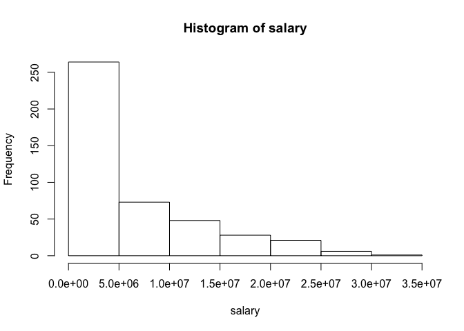
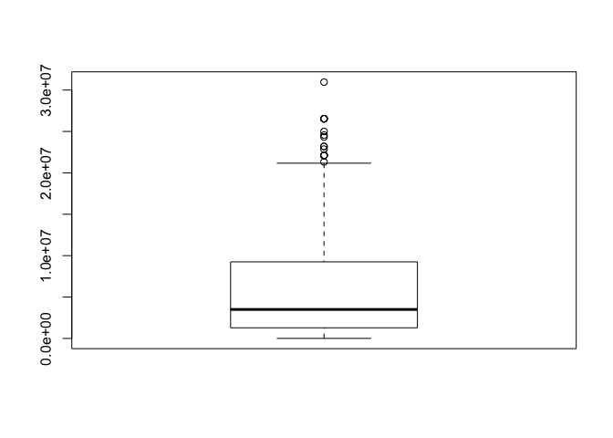
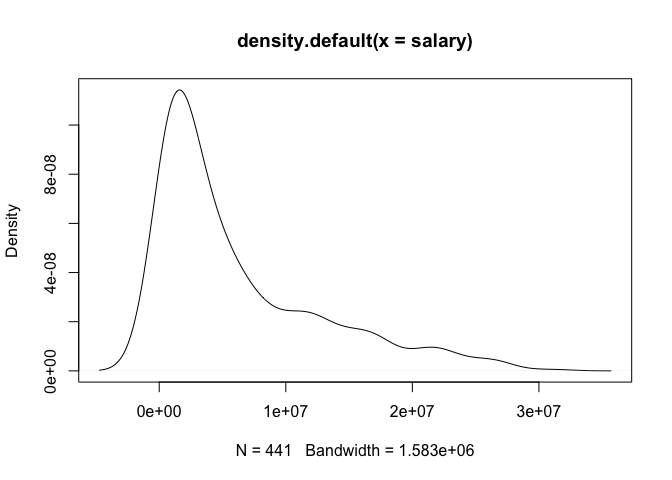
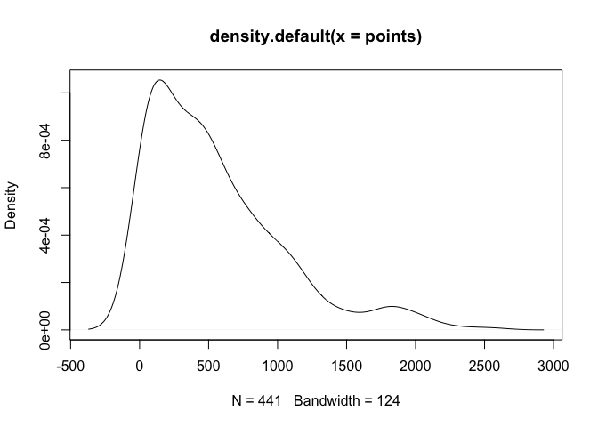
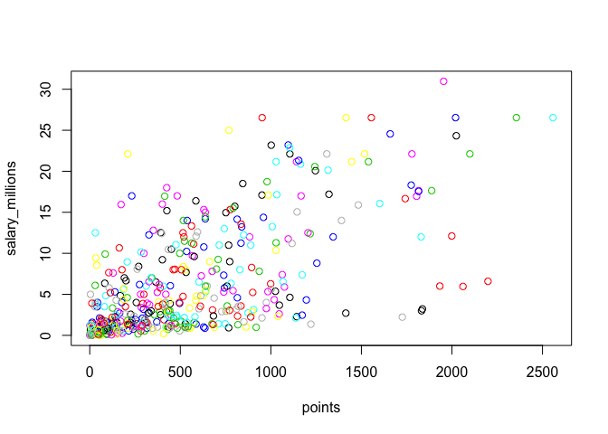
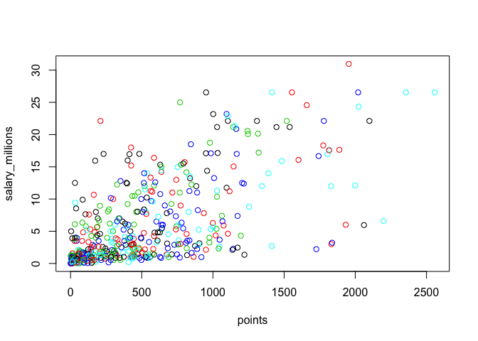

Warmup 2
================
Sizhuo(Cindy) Liu
February 6,2018

### Getting the Data File

``` r
load("/Users/sizhuoliu/nba2017-salary-points.RData")
```

### Data Processing

-   converting unit of salary

``` r
salary_millions <- salary/1000000
round(salary_millions,digits=2)
```

    ##   [1] 26.54 12.00  8.27  1.45  1.41  6.59  6.29  1.83  4.74  5.00  1.22
    ##  [12]  3.09  3.58  1.91  8.00  7.81  0.02  0.26  0.27  0.01  9.70 12.80
    ##  [23]  1.55  0.54 21.17  5.24 17.64 30.96  2.50 15.33  1.59  7.33  1.58
    ##  [34] 26.54 14.20  0.54  2.70 14.38 12.00  1.92  0.87  5.30  1.20  6.05
    ##  [45] 12.25  3.73 22.12  1.20  1.19  0.54 15.94  5.00 16.96 12.00  7.40
    ##  [56]  5.89  0.54  2.87  3.39  1.50  2.71 23.18  8.40  0.39 15.73  4.00
    ##  [67]  2.50  4.84  1.02 20.07  0.42  3.85  2.28  3.00 17.10  5.37  1.55
    ##  [78] 12.52 15.20  0.92  9.61  1.40 10.50  1.81  6.35  2.57  2.37  2.70
    ##  [89] 10.23  4.58  0.65  8.80  1.05  1.80  4.00  4.00 10.77  2.46 18.31
    ## [100]  1.05 14.15  3.49  1.45  2.11  0.87  2.09 23.20  1.02  1.64 17.55
    ## [111]  1.71  3.18  5.78  0.75 14.00 13.22  2.90 15.89 22.12  4.00  5.78
    ## [122]  0.87  2.59  1.23  0.21  0.54  5.63  4.00  6.00  1.02 22.12  6.50
    ## [133]  1.55  7.00  0.87  1.70  6.00 10.99  3.68  4.62  0.65  2.26 14.96
    ## [144]  2.97 17.20  1.05  0.10  0.87  5.32  2.73  6.51  0.16 12.00  6.33
    ## [155] 12.25 13.00 12.50 20.87  6.00  0.54 24.56  0.14 11.24 21.32 17.00
    ## [166]  1.02  4.32  3.90  6.19  0.54  0.54  2.90  0.54  1.41  1.38  4.35
    ## [177] 17.00  5.00  7.25  0.98  2.61 17.00 15.00  6.54  0.03  3.91 11.75
    ## [188]  0.03  0.95 10.00  0.03  2.32  9.00  4.79  9.42  4.83  1.51  2.99
    ## [199]  1.03  1.02  8.00  0.09  0.87  8.55  1.33  6.09  0.12 21.17  1.56
    ## [210]  1.07 11.48  0.98  3.00  3.33  1.79  2.50  1.40  0.98  0.73  9.25
    ## [221] 11.13  1.17  1.55 15.33  1.02  0.98  1.40 26.54  1.18 16.66  0.38
    ## [232]  0.54  5.78 12.11  2.90  0.54 10.00  1.55  0.54  1.18  2.90  0.17
    ## [243]  0.87 17.64  1.19 20.58 14.00  3.58 15.50 14.45  0.68  0.54  1.30
    ## [254] 12.39  0.26 26.54  0.54  7.00  1.00  6.00 18.74  1.72  7.81  0.15
    ## [265]  1.32 11.00 20.14  1.55  1.27 22.87 21.17  0.54  7.38 13.25  2.20
    ## [276]  1.40  3.50  1.55  5.63 10.15  7.00  3.94 11.05  8.00 16.07  1.02
    ## [287]  2.25 11.00  0.60  0.94  1.41  2.12  2.43  2.34  5.99  2.18  2.44
    ## [298]  2.48 17.15  0.98  1.19  4.84  3.75  0.25 26.54  0.54  3.14  8.95
    ## [309]  6.55  0.94  5.70 22.12  1.37  2.90  0.98  1.29 21.17 26.54  5.51
    ## [320]  3.33  4.26  1.79  0.08 10.36  7.68 18.50  3.22 24.33  6.67 16.39
    ## [331]  0.60  1.92  8.99  9.21  2.75  0.87  1.35  0.54 15.05  8.07  3.24
    ## [342]  1.66  3.21  4.54  1.99 12.08  1.63  2.33  3.50  1.36  5.00  3.53
    ## [353] 11.20  4.60 22.12  0.02  0.54  2.98 16.96  0.58  8.08  0.17 11.29
    ## [364]  9.90  0.06 11.24  2.09  0.65  1.02  4.23 25.00  0.54  8.38 22.12
    ## [375]  4.10  0.06  4.38  0.54  0.87  2.90 17.10  0.21  8.00 12.50  4.01
    ## [386]  3.52  5.23  8.00  2.20  8.05  5.20  1.44 13.33  1.19  1.32 10.66
    ## [397]  3.55  2.02  6.01  3.50  7.64  2.35  3.91  5.96  3.87  3.80  0.14
    ## [408] 13.55  3.05  1.34  2.24  5.28  7.60  5.33  0.07  1.03 12.50  3.27
    ## [419]  1.21 18.00  1.55  5.44  6.19  1.05 16.00  1.73  0.87  4.82 12.61
    ## [430]  0.54  2.22  4.28  0.02 14.00 10.47  4.00  2.94  0.28  2.13  0.92
    ## [441] 12.41

-   Renaming factors

``` r
position_fac<-factor(position,
                     levels=c("C","SF","PF","SG","PG"),
                     labels=c("center","small_fwd","power_fwd","shoot_guard","power_guard"))
position_fac
```

    ##   [1] center      power_fwd   shoot_guard power_guard small_fwd  
    ##   [6] power_guard small_fwd   shoot_guard small_fwd   power_fwd  
    ##  [11] power_fwd   center      shoot_guard power_guard center     
    ##  [16] center      small_fwd   power_guard power_fwd   center     
    ##  [21] shoot_guard shoot_guard small_fwd   power_guard power_fwd  
    ##  [26] shoot_guard power_guard small_fwd   small_fwd   center     
    ##  [31] small_fwd   shoot_guard power_guard shoot_guard small_fwd  
    ##  [36] power_guard center      center      power_guard center     
    ##  [41] shoot_guard small_fwd   power_fwd   power_fwd   power_fwd  
    ##  [46] small_fwd   shoot_guard power_guard power_fwd   center     
    ##  [51] center      center      power_guard center      power_fwd  
    ##  [56] small_fwd   shoot_guard shoot_guard power_guard small_fwd  
    ##  [61] power_guard center      power_fwd   power_guard small_fwd  
    ##  [66] power_fwd   power_guard small_fwd   center      power_fwd  
    ##  [71] power_fwd   small_fwd   shoot_guard small_fwd   center     
    ##  [76] power_fwd   shoot_guard center      small_fwd   shoot_guard
    ##  [81] power_guard power_fwd   power_fwd   shoot_guard power_fwd  
    ##  [86] center      shoot_guard power_guard center      small_fwd  
    ##  [91] power_fwd   power_guard power_guard power_fwd   shoot_guard
    ##  [96] power_fwd   shoot_guard center      small_fwd   power_fwd  
    ## [101] power_fwd   shoot_guard power_fwd   power_guard center     
    ## [106] shoot_guard shoot_guard shoot_guard power_guard small_fwd  
    ## [111] center      power_guard power_fwd   small_fwd   power_guard
    ## [116] center      shoot_guard power_guard center      power_fwd  
    ## [121] power_fwd   shoot_guard small_fwd   small_fwd   power_fwd  
    ## [126] shoot_guard power_guard center      shoot_guard center     
    ## [131] center      center      power_guard center      shoot_guard
    ## [136] power_fwd   power_guard power_fwd   shoot_guard small_fwd  
    ## [141] shoot_guard small_fwd   power_guard small_fwd   power_fwd  
    ## [146] power_guard power_guard power_fwd   power_fwd   center     
    ## [151] shoot_guard power_fwd   power_guard shoot_guard power_fwd  
    ## [156] small_fwd   center      shoot_guard power_guard shoot_guard
    ## [161] small_fwd   power_guard shoot_guard power_guard center     
    ## [166] shoot_guard power_fwd   center      power_fwd   center     
    ## [171] power_fwd   small_fwd   shoot_guard shoot_guard center     
    ## [176] small_fwd   center      power_guard power_guard small_fwd  
    ## [181] power_guard shoot_guard power_fwd   shoot_guard shoot_guard
    ## [186] small_fwd   center      shoot_guard center      small_fwd  
    ## [191] power_fwd   power_fwd   shoot_guard center      power_guard
    ## [196] center      small_fwd   shoot_guard center      small_fwd  
    ## [201] power_guard center      power_guard center      small_fwd  
    ## [206] power_fwd   shoot_guard center      small_fwd   power_guard
    ## [211] power_guard shoot_guard center      small_fwd   power_fwd  
    ## [216] shoot_guard small_fwd   shoot_guard power_guard power_fwd  
    ## [221] small_fwd   center      center      power_fwd   shoot_guard
    ## [226] power_fwd   center      small_fwd   center      shoot_guard
    ## [231] small_fwd   shoot_guard power_guard power_guard center     
    ## [236] shoot_guard shoot_guard power_fwd   power_fwd   power_guard
    ## [241] center      center      shoot_guard small_fwd   shoot_guard
    ## [246] power_fwd   shoot_guard power_guard center      power_guard
    ## [251] power_guard center      center      shoot_guard power_guard
    ## [256] power_guard power_fwd   shoot_guard center      shoot_guard
    ## [261] power_fwd   small_fwd   small_fwd   small_fwd   small_fwd  
    ## [266] shoot_guard power_fwd   power_fwd   power_fwd   power_guard
    ## [271] center      center      shoot_guard shoot_guard small_fwd  
    ## [276] center      small_fwd   power_guard small_fwd   shoot_guard
    ## [281] power_fwd   power_guard power_fwd   power_guard small_fwd  
    ## [286] center      small_fwd   small_fwd   power_fwd   power_guard
    ## [291] shoot_guard center      power_guard power_fwd   shoot_guard
    ## [296] small_fwd   power_fwd   small_fwd   center      small_fwd  
    ## [301] power_fwd   small_fwd   power_fwd   power_guard power_guard
    ## [306] power_guard center      power_fwd   shoot_guard power_guard
    ## [311] power_fwd   small_fwd   center      small_fwd   power_fwd  
    ## [316] power_fwd   center      power_guard shoot_guard shoot_guard
    ## [321] small_fwd   power_guard shoot_guard power_fwd   small_fwd  
    ## [326] shoot_guard shoot_guard power_guard power_fwd   small_fwd  
    ## [331] small_fwd   center      small_fwd   power_fwd   power_fwd  
    ## [336] shoot_guard power_guard shoot_guard small_fwd   power_fwd  
    ## [341] power_guard shoot_guard shoot_guard power_guard power_fwd  
    ## [346] power_fwd   shoot_guard center      small_fwd   center     
    ## [351] center      shoot_guard small_fwd   center      center     
    ## [356] small_fwd   power_fwd   small_fwd   center      power_fwd  
    ## [361] shoot_guard shoot_guard power_guard center      power_guard
    ## [366] small_fwd   power_guard center      shoot_guard power_guard
    ## [371] power_fwd   power_fwd   center      power_fwd   power_guard
    ## [376] power_fwd   center      small_fwd   center      power_guard
    ## [381] shoot_guard power_guard power_fwd   shoot_guard shoot_guard
    ## [386] shoot_guard power_guard shoot_guard center      center     
    ## [391] power_guard shoot_guard small_fwd   power_fwd   power_guard
    ## [396] small_fwd   center      power_fwd   small_fwd   shoot_guard
    ## [401] center      power_fwd   center      center      power_guard
    ## [406] power_fwd   small_fwd   power_guard small_fwd   power_guard
    ## [411] shoot_guard small_fwd   small_fwd   power_guard shoot_guard
    ## [416] center      shoot_guard power_fwd   power_fwd   small_fwd  
    ## [421] small_fwd   shoot_guard center      power_fwd   center     
    ## [426] power_guard center      center      shoot_guard small_fwd  
    ## [431] shoot_guard power_fwd   shoot_guard power_guard power_fwd  
    ## [436] shoot_guard power_fwd   power_guard small_fwd   power_guard
    ## [441] center     
    ## Levels: center small_fwd power_fwd shoot_guard power_guard

#### Quantitative Variable

-   Descriptive Statistics of Salary

``` r
summary(salary)
```

    ##     Min.  1st Qu.   Median     Mean  3rd Qu.     Max. 
    ##     5145  1286160  3500000  6187014  9250000 30963450

``` r
#average:typical value
mean(salary)
```

    ## [1] 6187014

``` r
#standard deviation:spread
sd(salary)
```

    ## [1] 6571890

``` r
#minimum value
min(salary)
```

    ## [1] 5145

``` r
#maximum value 
max(salary)
```

    ## [1] 30963450

``` r
#median value
median(salary)
```

    ## [1] 3500000

``` r
#quartiles
quantile(salary,c(0.25,0.5,0.75))
```

    ##     25%     50%     75% 
    ## 1286160 3500000 9250000

-   Descriptive Statistics of Points

``` r
#average:typical value
mean(points)
```

    ## [1] 546.6054

``` r
#standard deviation: spread
sd(points)
```

    ## [1] 489.0156

-   Graphs

``` r
#Distribution
hist(salary)
```



``` r
hist(points)
```


``` r
boxplot(salary)
```



``` r
boxplot(points)
```


``` r
#kernel density plot
plot(density(salary))
```



``` r
plot(density(points))
```



**Description of Overall Patterns**

-   For both the plots for salary and for points, the density is the highest at the lower end, and gradually fade away as the salary/score increases.
-   There are no striking deviations in either plot.

#### Qualitative Variable

-   Creating Factors

``` r
#turn team into a R factor
team_fac<-factor(team)
team_fac
```

    ##   [1] BOS BOS BOS BOS BOS BOS BOS BOS BOS BOS BOS BOS BOS BOS BOS CLE CLE
    ##  [18] CLE CLE CLE CLE CLE CLE CLE CLE CLE CLE CLE CLE CLE TOR TOR TOR TOR
    ##  [35] TOR TOR TOR TOR TOR TOR TOR TOR TOR TOR TOR WAS WAS WAS WAS WAS WAS
    ##  [52] WAS WAS WAS WAS WAS WAS WAS WAS ATL ATL ATL ATL ATL ATL ATL ATL ATL
    ##  [69] ATL ATL ATL ATL ATL MIL MIL MIL MIL MIL MIL MIL MIL MIL MIL MIL MIL
    ##  [86] MIL MIL IND IND IND IND IND IND IND IND IND IND IND IND IND IND CHI
    ## [103] CHI CHI CHI CHI CHI CHI CHI CHI CHI CHI CHI CHI CHI CHI MIA MIA MIA
    ## [120] MIA MIA MIA MIA MIA MIA MIA MIA MIA MIA MIA DET DET DET DET DET DET
    ## [137] DET DET DET DET DET DET DET DET DET CHO CHO CHO CHO CHO CHO CHO CHO
    ## [154] CHO CHO CHO CHO CHO CHO CHO NYK NYK NYK NYK NYK NYK NYK NYK NYK NYK
    ## [171] NYK NYK NYK NYK NYK ORL ORL ORL ORL ORL ORL ORL ORL ORL ORL ORL ORL
    ## [188] ORL ORL ORL PHI PHI PHI PHI PHI PHI PHI PHI PHI PHI PHI PHI PHI PHI
    ## [205] PHI BRK BRK BRK BRK BRK BRK BRK BRK BRK BRK BRK BRK BRK BRK BRK GSW
    ## [222] GSW GSW GSW GSW GSW GSW GSW GSW GSW GSW GSW GSW GSW GSW SAS SAS SAS
    ## [239] SAS SAS SAS SAS SAS SAS SAS SAS SAS SAS SAS SAS HOU HOU HOU HOU HOU
    ## [256] HOU HOU HOU HOU HOU HOU HOU HOU HOU LAC LAC LAC LAC LAC LAC LAC LAC
    ## [273] LAC LAC LAC LAC LAC LAC LAC UTA UTA UTA UTA UTA UTA UTA UTA UTA UTA
    ## [290] UTA UTA UTA UTA UTA OKC OKC OKC OKC OKC OKC OKC OKC OKC OKC OKC OKC
    ## [307] OKC OKC OKC MEM MEM MEM MEM MEM MEM MEM MEM MEM MEM MEM MEM MEM MEM
    ## [324] MEM POR POR POR POR POR POR POR POR POR POR POR POR POR POR DEN DEN
    ## [341] DEN DEN DEN DEN DEN DEN DEN DEN DEN DEN DEN DEN DEN NOP NOP NOP NOP
    ## [358] NOP NOP NOP NOP NOP NOP NOP NOP NOP NOP DAL DAL DAL DAL DAL DAL DAL
    ## [375] DAL DAL DAL DAL DAL DAL DAL DAL SAC SAC SAC SAC SAC SAC SAC SAC SAC
    ## [392] SAC SAC SAC SAC SAC SAC MIN MIN MIN MIN MIN MIN MIN MIN MIN MIN MIN
    ## [409] MIN MIN MIN LAL LAL LAL LAL LAL LAL LAL LAL LAL LAL LAL LAL LAL LAL
    ## [426] LAL PHO PHO PHO PHO PHO PHO PHO PHO PHO PHO PHO PHO PHO PHO PHO
    ## 30 Levels: ATL BOS BRK CHI CHO CLE DAL DEN DET GSW HOU IND LAC LAL ... WAS

``` r
table(team_fac)
```

    ## team_fac
    ## ATL BOS BRK CHI CHO CLE DAL DEN DET GSW HOU IND LAC LAL MEM MIA MIL MIN 
    ##  14  15  15  15  15  15  15  15  15  15  14  14  15  15  15  14  14  14 
    ## NOP NYK OKC ORL PHI PHO POR SAC SAS TOR UTA WAS 
    ##  14  15  15  15  15  15  14  15  15  15  15  14

``` r
frequency<-table(team_fac)
relative_frequency<-frequency/441
relative_frequency
```

    ## team_fac
    ##        ATL        BOS        BRK        CHI        CHO        CLE 
    ## 0.03174603 0.03401361 0.03401361 0.03401361 0.03401361 0.03401361 
    ##        DAL        DEN        DET        GSW        HOU        IND 
    ## 0.03401361 0.03401361 0.03401361 0.03401361 0.03174603 0.03174603 
    ##        LAC        LAL        MEM        MIA        MIL        MIN 
    ## 0.03401361 0.03401361 0.03401361 0.03174603 0.03174603 0.03174603 
    ##        NOP        NYK        OKC        ORL        PHI        PHO 
    ## 0.03174603 0.03401361 0.03401361 0.03401361 0.03401361 0.03401361 
    ##        POR        SAC        SAS        TOR        UTA        WAS 
    ## 0.03174603 0.03401361 0.03401361 0.03401361 0.03401361 0.03174603

### Scatterplot of Points and Salary

-   Scatterplot Color-coded Based on Team

``` r
plot(points,salary_millions,col=team_fac)
```



-   Scatterplot Color-coded Based on Position

``` r
plot(points,salary_millions,col=position_fac)
```



### Correlation Between Points and Salary

-   Mean of points/Points

``` r
points_mean <- (1/441)*sum(points)
points_mean
```

    ## [1] 546.6054

-   Mean of Salary

``` r
salary_mean <- (1/441)*sum(salary)
salary_mean
```

    ## [1] 6187014

-   Variance of points/Points

``` r
n <- length(player)
points_var <- (1/(n-1))*sum((points-points_mean)^2)
points_var
```

    ## [1] 239136.2

-   Variance of Salary

``` r
salary_var <- (1/(n-1))*sum((salary-salary_mean)^2)
salary_var
```

    ## [1] 4.318973e+13

-   Standard Deviation of points/Points

``` r
points_sd <-sqrt(points_var)
points_sd
```

    ## [1] 489.0156

-   Standard Deviation of Salary

``` r
salary_sd <- sqrt(salary_var)
salary_sd
```

    ## [1] 6571890

-   Covariance of points/Points and Salary

``` r
points_salary_cov <- (1/(n-1))*sum((points-points_mean)*(salary-salary_mean))
points_salary_cov
```

    ## [1] 2046212512

-   Correlation Between points and Salary

``` r
points_salary_corr <- points_salary_cov / ((points_sd)*(salary_sd))
points_salary_corr
```

    ## [1] 0.6367043

### Comments and Reflections

-   The one part that is relatively hard for me is plotting the graphs. Although we have already done that in labs, I found them difficult because I think that it is tricky to set up the graph in a way so that they are organized and easily understandable.

-   The part that is relatively easy for me was calculating the mean, variance, standard deviation, etc. of the data. Since I know the formulas for calculating these things, it is very straightforward to apply the calculations in R.

-   I needed help with this assignment as I was stuck on some parts such as using the sigma notation correctly. The issue was solved when I attended my GSI's office hour, where she offered hints to help me solve the problem.

-   It took in total around 3 hours (mainly because I spent a very long time on one single part).

-   The most time-consuming part was calculating the mean/sd/variance, etc. as I had to double check to make sure I got the right answers.

-   The one thing that I think that I still haven't fully grasped is the idea of factor vs. general vectors. Although I know how to apply them, I still do not fully understand the reasoning behind using one as opposed to the other.

-   The most frustrating part was figuring out how to use the sigma notation as I spent the most time on this and had to look for information online.
